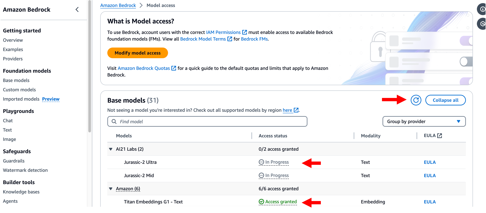

# Amazon Bedrock 모델 접근 설정

Amazon Bedrock을 활용하여 Generative AI 애플리케이션을 구축하기 위해서는 먼저 Bedrock 모델에 접근할 수 있어야 합니다.  
이 과정에서는 AWS 콘솔을 통해 Bedrock 모델 접근 권한을 설정하고 필요한 리소스를 준비합니다.

---

## 실습 절차

1. **AWS 콘솔** 상단 검색창에 `Amazon Bedrock`을 입력하고 클릭합니다.

   

2. 좌측 **사이드 메뉴**를 펼칩니다.

   

3. 사이드 메뉴에서 **Model access**를 선택합니다.

   

4. **Enable all models** 버튼을 클릭합니다.

   

5. 아래 나열된 체크박스가 선택된 모델을 확인합니다.  
   자신의 계정에서 실행하는 경우, 모델을 활성화하는 데 비용이 들지 않으며 **실습 기간 동안 사용한 만큼만 비용이 청구**됩니다.  
   필요에 따라 각 모델의 EULA를 검토한 후, **Next** 버튼을 클릭합니다.

   

6. 모델을 활성화하기 위해 **Submit** 버튼을 클릭합니다.

   

7. 모델 액세스 상태를 모니터링합니다.  
   모델이 `In Progress`에서 `Access granted` 상태로 바뀌는 데 **몇 분 정도 소요될 수 있습니다**.  
   **새로 고침(Refresh)** 버튼을 클릭하여 상태 업데이트를 확인합니다.

   

8. 모델 액세스 상태가 **Access granted**로 변경되었는지 최종 확인합니다.

---

> ⚠️ 참고: 모델 접근 권한이 활성화된 이후에는 Bedrock API 또는 콘솔을 통해 모델 사용이 가능합니다.
