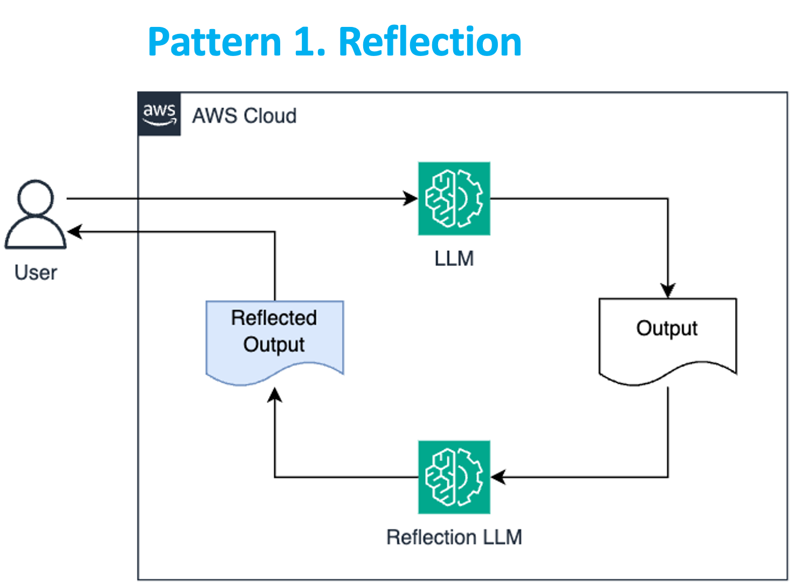
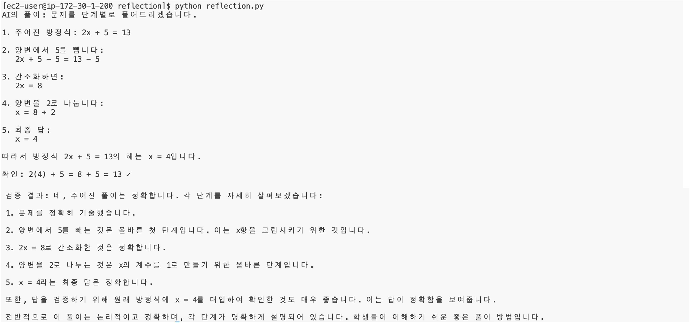

# 패턴 1: Reflection

 

## Architecture

Reflection 패턴은 AI가 자신의 출력을 **평가하고 개선**하는 능력을 향상시키는 방법입니다. 이 패턴은 AI가 마치 인간 검토자처럼 자신의 결과물을 검토하고 개선하는 과정을 모델링합니다.

---

## 주요 특징

- **자체 평가**: AI가 자신의 출력을 검토하고 분석합니다.
- **오류 식별**: 잠재적인 문제점이나 개선이 필요한 부분을 찾아냅니다.
- **개선 제안**: 식별된 문제에 대한 해결책을 제시합니다.
- **반복적 개선**: 필요에 따라 여러 번의 개선 과정을 거칩니다.

이 패턴은 **콘텐츠 생성, 문제 해결, 코드 작성** 등 **정밀도가 요구되는 작업**에 특히 유용합니다. Reflection을 통해 AI는 자체적으로 오류를 수정하고 품질을 향상시킬 수 있어, 더 신뢰할 수 있고 정확한 결과를 제공합니다.

---

## 실습 목표

이 실습에서는 수학 문제 풀이와 그 풀이의 검증을 통해 **Reflection 패턴을 구현**합니다.

---

## 실습 코드

### 1. `reflection.py` 파일 생성

경로: `workshop/ko/pattern/reflection/reflection.py`

### 2. 라이브러리 임포트

```python
import boto3
```

---

### 3. Bedrock 모델 호출 함수 정의

```python
def get_bedrock_response(prompt, model_id):
    session = boto3.Session()
    bedrock = session.client(service_name='bedrock-runtime')

    response = bedrock.converse(
        modelId=model_id,
        messages=[{"role": "user", "content": [{"text": prompt}]}],
        inferenceConfig={"maxTokens": 2000, "temperature": 0.0}
    )

    return response['output']['message']['content'][0]['text']
```

---

### 4. 수학 문제 풀이 함수 정의 (초기 생성 단계)

```python
def solve_math_problem(problem):
    prompt = f"다음 수학 문제를 풀어주세요:\n문제: {problem}"
    return get_bedrock_response(prompt, "anthropic.claude-3-5-haiku-20241022-v1:0")
```

---

### 5. 풀이 검증 함수 정의 (자체 평가 단계)

```python
def validate_solution(problem, solution):
    prompt = f"다음 수학 문제와 그에 대한 풀이를 검토해주세요:\n문제: {problem}\n풀이: {solution}"
    return get_bedrock_response(prompt, "anthropic.claude-3-5-sonnet-20240620-v1:0")
```

---

### 6. 수학 문제에 대한 처리 코드 작성

```python
math_problem = "2x + 5 = 13 방정식을 풀어주세요."

solution = solve_math_problem(math_problem)
print(f"AI의 풀이: {solution}\n\n")

validation = validate_solution(math_problem, solution)
print(f"검증 결과: {validation}")
```

---

## 실행 방법

1. VSCode에서 상단 메뉴 → **Terminal > New Terminal** 선택
2. 아래 명령어 입력:

```bash
cd ~/workshop/ko/pattern/reflection
python reflection.py
```

---

## 결과
 


> 이 실습을 통해 Reflection 패턴의 **두 가지 핵심 단계인 초기 생성과 자체 평가**를 경험할 수 있습니다.  
> 첫 번째 AI 모델이 수학 문제를 풀고, 두 번째 AI 모델이 그 풀이를 검증함으로써 **AI가 자체적으로 결과를 평가하고 개선하는 과정**을 보여줍니다.
