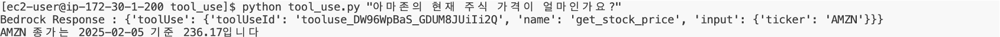

# 패턴 2: Tool Use

 

## Architecture

Tool Use 패턴은 AI가 **외부 도구와 리소스를 활용하여 자신의 능력을 확장**하는 방법입니다.  
이 패턴을 통해 AI는 내부 지식을 넘어 실제 세계의 데이터와 기능에 접근할 수 있습니다.

---

## 주요 특징

- **외부 리소스 활용**: 데이터베이스, 웹 검색, API 등 활용
- **기능 확장**: 단순 텍스트 생성을 넘어 복잡한 작업 수행 가능
- **동적 상호작용**: 외부 시스템과 실시간 상호작용
- **다양한 응용**: 데이터 검색, 계산, 이미지 처리 등

예: 최신 주식 가격 조회, 날씨 확인, 수학 계산 등

---

## 실습 목표

실시간 **주식 가격 조회 기능**을 구현하여 AI가 외부 도구를 활용하는 Tool Use 패턴을 학습합니다.

---

## 실습 코드

### 1. `tool_use.py` 파일 생성

경로: `workshop/ko/pattern/tool_use/tool_use.py`

### 2. 라이브러리 임포트

```
import boto3
import yfinance as yf 
import sys
```

---

### 3. 주식 가격을 가져오는 도구 함수 정의

```
def get_stock_price(ticker):
    stock_data = yf.Ticker(ticker)
    historical_data = stock_data.history(period='1d')

    date = historical_data.index[0].strftime('%Y-%m-%d')
    current_price = historical_data['Close'].iloc[0]
    return f"{ticker} 종가는 {date} 기준 {current_price:.2f}입니다"
```

---

### 4. 도구 구성 정의

```
tool_config = {
    "tools": [
        {
            "toolSpec": {
                "name": "get_stock_price",
                "description": "주어진 ticker의 현재 주식 가격을 가져옵니다.",
                "inputSchema": {
                    "json": {
                        "type": "object",
                        "properties": {
                            "ticker": {
                                "type": "string",
                                "description": "주식의 ticker"
                            }
                        },
                        "required": [
                            "ticker"
                        ]
                    }
                }
            }
        }
    ]
}
```

---

### 5. Bedrock 모델 호출 함수 정의

```
def get_response(user_question):
    session = boto3.Session()
    bedrock = session.client(service_name='bedrock-runtime')

    response = bedrock.converse(
        modelId='anthropic.claude-3-5-sonnet-20240620-v1:0',
        messages=[{"role": "user", "content": [{"text": user_question}]}],
        toolConfig=tool_config,
        inferenceConfig={"maxTokens": 2000,  "temperature": 0.0}
    )
    return response
```

---

### 6. 도구 사용 결과 처리 함수 정의

```
def handle_tool_use(response):
    if response.get('stopReason') == 'tool_use':
        tool_requests = response['output']['message']['content']
        for tool_request in tool_requests:
            if 'toolUse' in tool_request:
                tool_use = tool_request['toolUse']
                print(f"Bedrock Response : {tool_request}")

                if tool_use['name'] == 'get_stock_price':
                    ticker = tool_use['input']['ticker']
                    return get_stock_price(ticker)

    return response['output']['message']['content'][0]['text']
```

---

### 7. 사용자 질문을 받아 실행하는 코드

```
user_question = sys.argv[1]
response = get_response(user_question)
result = handle_tool_use(response)
print(result)
```

---

## 실행 방법

1. VSCode에서 상단 메뉴 → **Terminal > New Terminal** 선택
2. 아래 명령어 입력:

```
cd ~/workshop/ko/pattern/tool_use
```

3. 아마존 주식 가격을 조회:

```
python tool_use.py "아마존의 현재 주식 가격이 얼마인가요?"
```

---

## 결과 예시



---

> 이 실습을 통해 AI가 외부 도구를 실시간으로 활용하여 정보를 수집하고 응답하는 **Tool Use 패턴의 개념과 구현 방법**을 익힐 수 있습니다.
