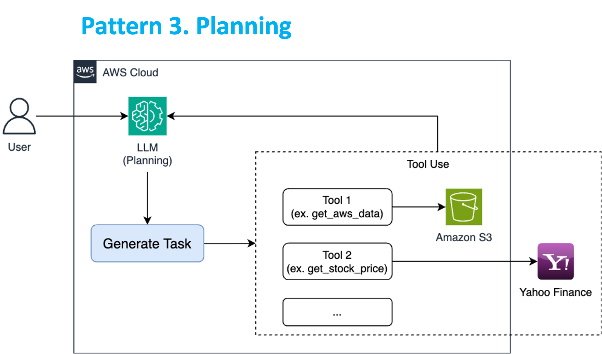
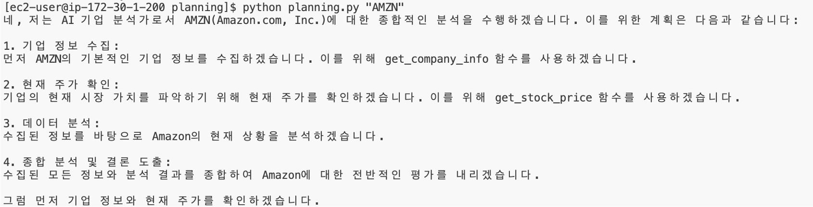

# 패턴 3: Planning

 

## Architecture

Planning 패턴은 AI가 복잡한 작업을 **체계적으로 접근하고 효율적으로 해결**할 수 있게 해주는 전략입니다.  
AI는 큰 목표를 **작은 단계로 나누고**, 이를 달성하기 위한 **구체적인 계획을 수립**합니다.

---

## 주요 특징

- **작업 분해**: 복잡한 목표를 관리 가능한 하위 작업으로 분할
- **전략적 구조화**: 목표 달성을 위한 단계를 체계적으로 구성
- **효율적 실행**: 계획에 따라 작업 수행 및 모니터링
- **유연한 조정**: 상황에 맞춰 계획 수정 및 적응 가능

이 패턴은 **프로젝트 관리, 복잡한 문제 해결, 다단계 의사 결정 과정**에서 특히 유용합니다.

---

## 실습 목표

AI 기업 분석가 시스템을 구현하여 복잡한 작업을 체계적으로 계획하고 수행하는 **Planning 패턴을 학습**합니다.

---

## 실습 코드

### 1. `planning.py` 파일 생성

경로: `workshop/ko/pattern/planning/planning.py`

---

### 2. 라이브러리 임포트

```
import boto3
import json
import sys
```

---

### 3. Bedrock 모델 호출 함수 정의

```
def get_bedrock_response(prompt, model_id, tool_config):
    session = boto3.Session()
    bedrock = session.client(service_name='bedrock-runtime')

    response = bedrock.converse(
        modelId=model_id,
        messages=[{"role": "user", "content": [{"text": prompt}]}],
        toolConfig=tool_config,
        inferenceConfig={"maxTokens": 2000,  "temperature": 0.0}
    )

    return response['output']['message']['content'][0]['text']
```

---

### 4. 도구 구성 정의 (1차: 주식 가격 조회)

```
tool_config = {
    "tools": [
        {
            "toolSpec": {
                "name": "get_stock_price",
                "description": "주어진 ticker의 현재 주식 가격을 가져옵니다.",
                "inputSchema": {
                    "json": {
                        "type": "object",
                        "properties": {
                            "ticker": {
                                "type": "string",
                                "description": "주식의 ticker"
                            }
                        },
                        "required": ["ticker"]
                    }
                }
            }
        }
    ]
}
```

---

### 5. 도구 구성 확장 (2차: 기업 정보 조회 추가)

```
tool_config["tools"].append({
    "toolSpec": {
        "name": "get_company_info",
        "description": "주어진 ticker의 기업 정보(회사명, 산업, 시가총액 등)를 가져옵니다.",
        "inputSchema": {
            "json": {
                "type": "object",
                "properties": {
                    "ticker": {
                        "type": "string",
                        "description": "기업의 ticker"
                    }
                },
                "required": ["ticker"]
            }
        }
    }
})
```

---

### 6. 기업 분석 계획 생성 함수 정의

```
def plan_company_analysis(ticker):
    prompt = f"당신은 AI 기업 분석가입니다. 당신의 목표는 {ticker} 기업에 대한 종합적인 분석을 수행합니다. 목표를 달성하기 위한 당신의 계획을 알려주세요"
    return get_bedrock_response(prompt, "anthropic.claude-3-5-sonnet-20240620-v1:0", tool_config)
```

---

### 7. 실행 코드

```
ticker = sys.argv[1]
analysis_plan = plan_company_analysis(ticker)
print(analysis_plan)
```

---

## 실행 방법

1. VSCode에서 상단 메뉴 → **Terminal > New Terminal** 선택
2. 아래 명령어 입력:

```
cd ~/workshop/ko/pattern/planning
```

3. 예시: AMZN 기업 분석 계획 실행

```
python planning.py "AMZN"
```

---

## 결과



> 이 실습을 통해 AI가 **목표 설정 → 계획 수립 → 도구 사용을 통한 실행** 흐름으로 복잡한 작업을 처리하는 Planning 패턴을 경험하게 됩니다.
