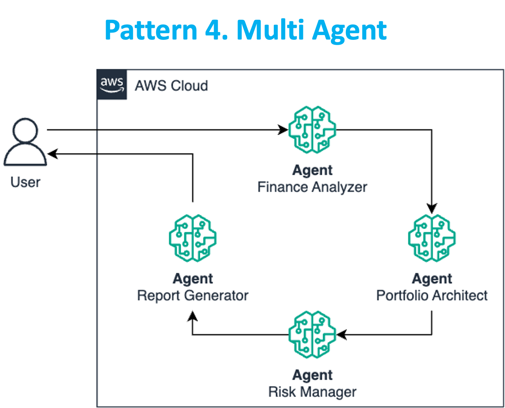
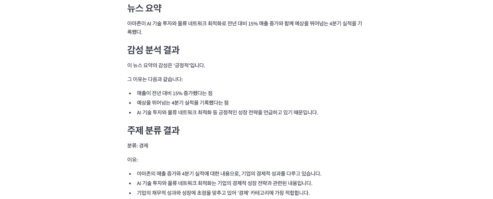

# 패턴 4: Multi Agent

 

## Architecture

Multi Agent 패턴은 복잡한 작업을 **여러 전문화된 AI 에이전트가 협력하여 해결**하는 방식입니다.  
이 패턴은 인간 팀의 프로젝트 관리와 유사하게, 각 에이전트가 특정 역할을 맡아 **독립적으로 작업하면서 협력**합니다.

---

## 주요 특징

- **작업 분할**: 복잡한 문제를 manageable 단위로 나눔
- **전문화**: 각 에이전트는 고유 기능 또는 역할에 특화
- **협력**: 정보 교환 및 중간 결과 공유
- **결과 통합**: 각 에이전트의 결과를 종합하여 최종 출력 생성

예:  
- 요약 에이전트  
- 감성 분석 에이전트  
- 주제 분류 에이전트

---

## 실습 1: Library 구현

### 경로

`workshop/ko/pattern/multi_agent/multi_agent_lib.py`

---

### 1. 라이브러리 임포트

```
import boto3
```

---

### 2. Bedrock 모델 호출 함수

```
def get_bedrock_response(prompt, model_id):
    session = boto3.Session()
    bedrock = session.client(service_name='bedrock-runtime')

    response = bedrock.converse(
        modelId=model_id,
        messages=[{"role": "user", "content": [{"text": prompt}]}],
        inferenceConfig={"maxTokens": 2000, "temperature": 0.0}
    )

    return response['output']['message']['content'][0]['text']
```

---

### 3. 뉴스 요약 에이전트

```
def summarize_news(news):
    prompt = f"다음 뉴스를 1문장으로 요약해주세요:\n\n{news}"
    return get_bedrock_response(prompt, "anthropic.claude-3-5-haiku-20241022-v1:0")
```

---

### 4. 감성 분석 에이전트

```
def analyze_sentiment(summary):
    prompt = f"다음 뉴스 요약의 감성을 분석하여 '긍정적', '중립적', '부정적' 중 하나로 평가해주세요:\n\n{summary}"
    return get_bedrock_response(prompt, "anthropic.claude-3-5-haiku-20241022-v1:0")
```

---

### 5. 주제 분류 에이전트

```
def classify_topic(summary):
    prompt = f"다음 뉴스 요약의 주제를 '정치', '경제', '사회', '기술', '문화' 중 하나로 분류해주세요:\n\n{summary}"
    return get_bedrock_response(prompt, "anthropic.claude-3-5-haiku-20241022-v1:0")
```

---

## 실습 2: Streamlit 프론트엔드

### 경로

`workshop/ko/pattern/multi_agent/multi_agent_app.py`

---

### 1. 라이브러리 임포트

```
import streamlit as st
import multi_agent_lib as ma
```

---

### 2. 페이지 설정

```
st.set_page_config(page_title="뉴스 분석 시스템")
st.title("뉴스 분석 시스템")
```

---

### 3. 사용자 입력 받기

```
news = st.text_area("뉴스 기사를 입력하세요:", height=200)
```

---

### 4. 분석 버튼 클릭 시 처리 로직

```
if st.button("분석 시작"):
    with st.spinner("뉴스 분석 중..."):
        st.subheader("뉴스 요약")
        summary = ma.summarize_news(news)
        st.write(summary)

        st.subheader("감성 분석 결과")
        sentiment = ma.analyze_sentiment(summary)
        st.write(sentiment)

        st.subheader("주제 분류 결과")
        topic = ma.classify_topic(summary)
        st.write(topic)
```

---

## 실행 방법

1. VSCode 메뉴 → **Terminal > New Terminal** 선택
2. 디렉터리 이동

```
cd ~/workshop/ko/pattern/multi_agent
```

3. Streamlit 앱 실행

```
streamlit run multi_agent_app.py --server.port 8080
```

4. 터미널의 External URL 클릭 또는 복사해서 브라우저 접속

---

## 결과


