# 모듈 0-1. S3 버킷 생성 및 업로드

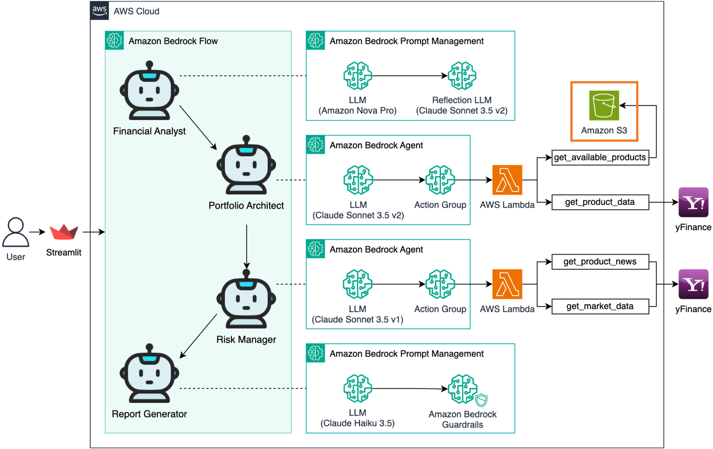

## Architecture

Amazon S3 버킷을 생성하고 AI 투자 어드바이저에 필요한 파일들을 업로드합니다.

---

## 실습 단계

### 1. S3 콘솔 접속

AWS 콘솔에서 `S3` 서비스를 검색하고 클릭합니다.

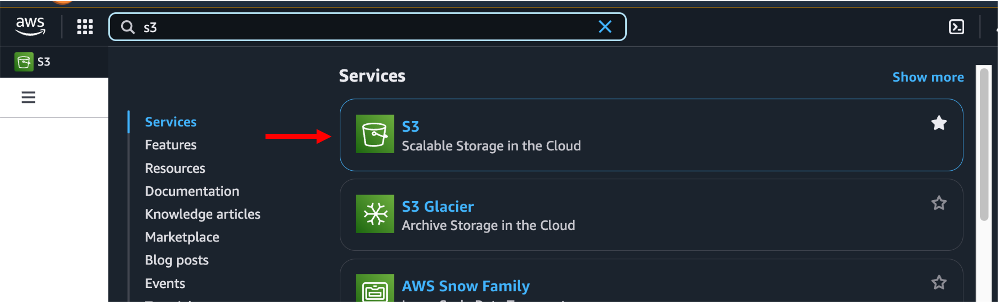

---

### 2. S3 버킷 생성

**Create bucket** 버튼을 클릭하여 새로운 S3 버킷을 생성합니다.

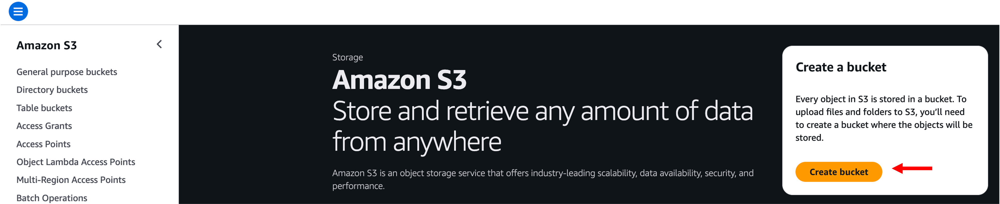

---

### 3. 고유한 버킷 이름 입력

버킷 이름을 다음과 같이 입력합니다:

```
agenticai-{unique-identifier}
```


> `{unique-identifier}`는 각 사용자의 **Account ID** 또는 고유 문자열로 대체해야 합니다.

나머지 옵션은 기본값으로 두고 **Create bucket** 클릭

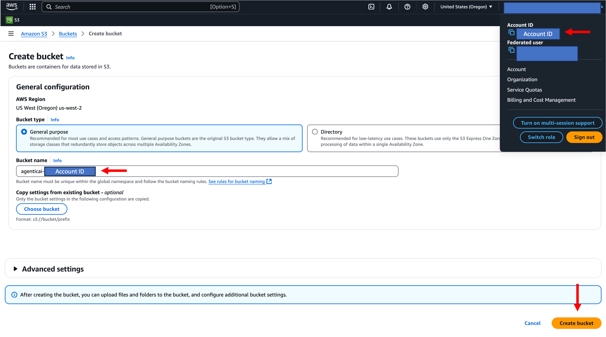

---

### 4. 버킷 접속 및 업로드 시작

버킷을 클릭하고 **Upload** 버튼을 클릭합니다.

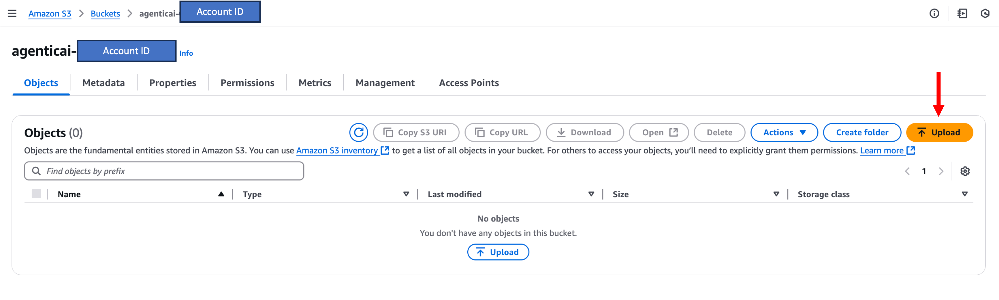

---

### 5. 애플리케이션 파일 다운로드

아래 링크에서 `available_products.json` 파일을 다운로드합니다.

**Download JSON** (Right-click and select 'Save link as')

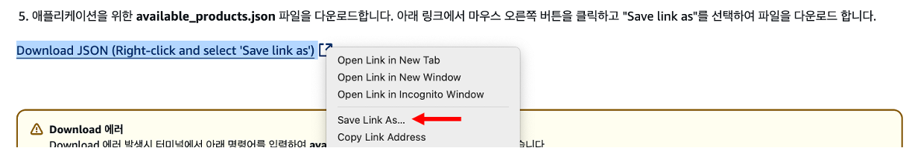

---

### 6. 다운로드 오류 발생 시

터미널에서 다음 명령어를 입력하여 수동 다운로드합니다:

```
curl -o available_products.json "https://ws-assets-prod-iad-r-pdx-f3b3f9f1a7d6a3d0.s3.us-west-2.amazonaws.com/5d74d234-0149-4b82-982a-4c040b85d0f2/available_products.json"
```

---

### 7. 파일 업로드 진행

- **Add files** 클릭  
- `available_products.json` 파일 선택  
- **Upload** 버튼 클릭

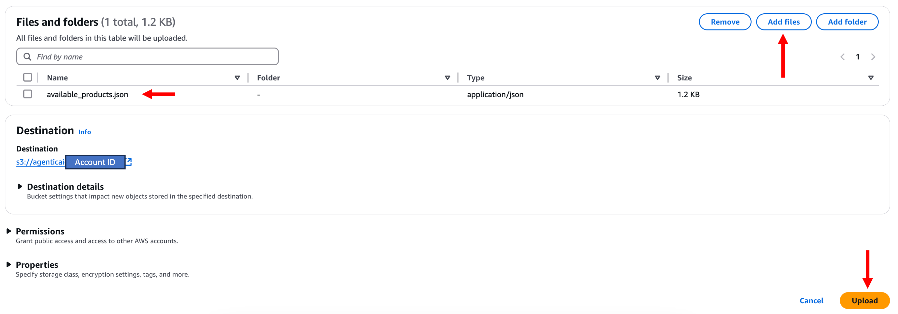

---

### 8. 업로드 완료 후 확인

**Close** 버튼 클릭

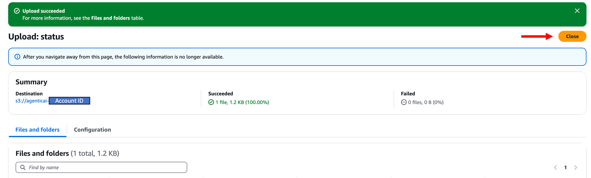

버킷 안에 파일이 존재하는지 확인합니다.

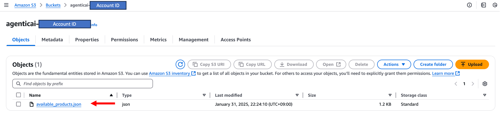

---

### 9. yfinance 패키지 업로드

같은 방식으로 `yfinance.zip` 파일도 업로드합니다.

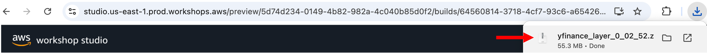

---

### 10. 다운로드 오류 발생 시

터미널에서 다음 명령어로 수동 다운로드:

```
curl -o yfinance.zip "https://ws-assets-prod-iad-r-pdx-f3b3f9f1a7d6a3d0.s3.us-west-2.amazonaws.com/5d74d234-0149-4b82-982a-4c040b85d0f2/yfinance.zip"
```

---

### 11. 업로드 확인

버킷 안에 `yfinance.zip` 파일이 정상 업로드 되었는지 확인합니다.

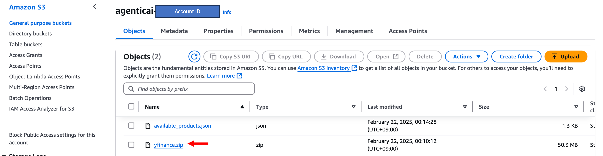

---

## 마무리

> 이제 S3 버킷을 만들고, AI 투자 어드바이저에 필요한 파일들을 업로드하였습니다.  
> 이 파일들은 이후 모듈에서 AI 투자 시스템 구축에 사용됩니다.
