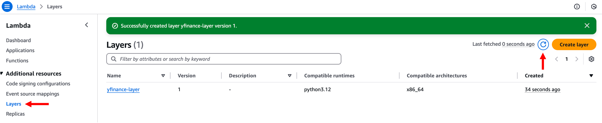

# 모듈 0-2. Lambda Layer 생성

## Architecture

`yfinance` 패키지를 사용하여 투자 상품 데이터를 수집할 수 있도록 **AWS Lambda Layer**를 설정합니다.  
이 Layer는 이후 Lab에서 생성할 **Lambda 함수에서 재사용**됩니다.

---

## 실습 단계

### 1. yfinance.zip S3 URL 복사

Amazon S3 서비스로 이동하여, 이전 모듈에서 업로드한 `yfinance.zip` 파일을 선택합니다.  
**Copy URL** 버튼을 클릭하여 URL을 복사하고, 메모장 등에 저장합니다.

---

### 2. Lambda 콘솔 접속

AWS 콘솔 상단 검색창에 `Lambda`를 입력하고 클릭합니다.

---

### 3. Layer 생성

Lambda 좌측 메뉴에서 **Layers** 클릭 → **Create layer** 클릭

---

### 4. Layer 구성 정보 입력

다음과 같이 입력합니다:

- **Name**: `yfinance-layer` (또는 원하는 이름)
- **Upload a file from Amazon S3**: 앞에서 복사한 `yfinance.zip`의 S3 URL
- **Compatible architectures**: `x86_64`
- **Compatible runtimes**: `Python 3.12`
- **License**: `Apache License 2.0`

**Create** 버튼 클릭

---

### 5. 생성된 Layer 확인

Layers 메뉴로 돌아가 `yfinance-layer`가 목록에 있는지 확인합니다.  
보이지 않을 경우 **새로 고침(Refresh)** 버튼을 클릭합니다.

---

## 주의사항: yfinance 사용 시

- `yfinance`는 **Yahoo, Inc.와 제휴하거나 승인된 라이브러리가 아닙니다.**
- 연구 및 교육 목적으로만 사용해야 하며, **개인적 사용**에 한합니다.
- Yahoo의 **이용 약관**을 반드시 확인하고 따르세요.

---

## 마무리

> 이제 `yfinance` 패키지를 포함한 **Lambda Layer가 성공적으로 생성**되었습니다.  
> 이 Layer는 이후 Lab에서 투자 상품 데이터를 수집하고 분석하는 **Lambda 함수에서 참조**될 것입니다.
