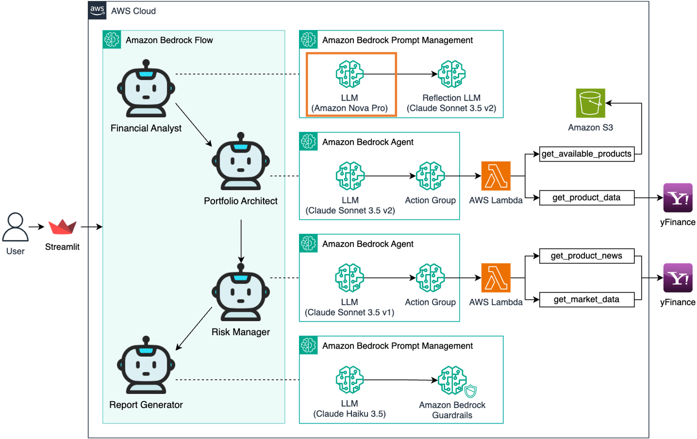
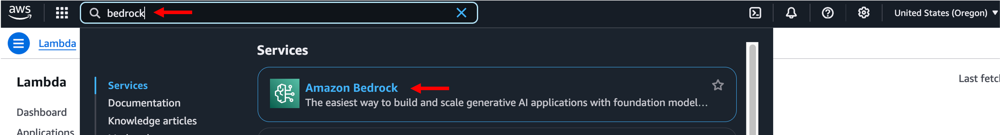
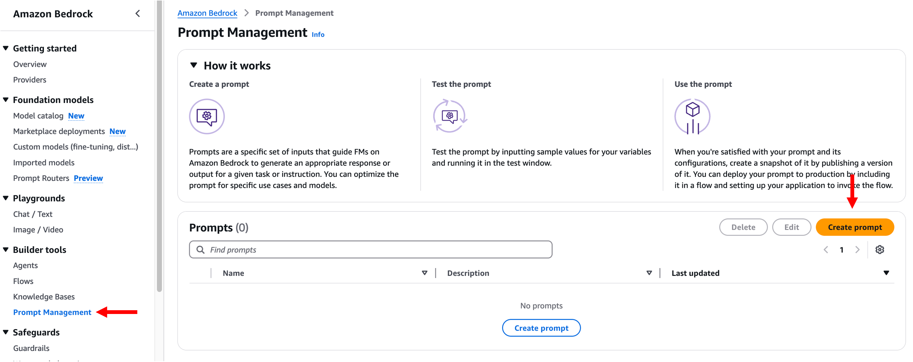
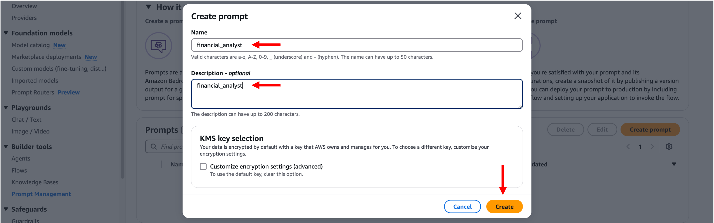
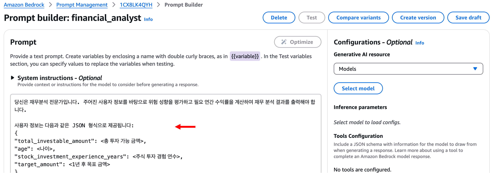
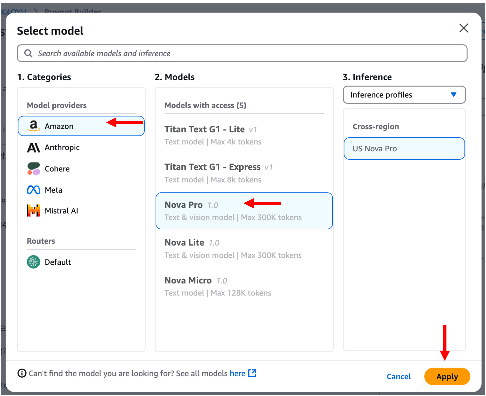
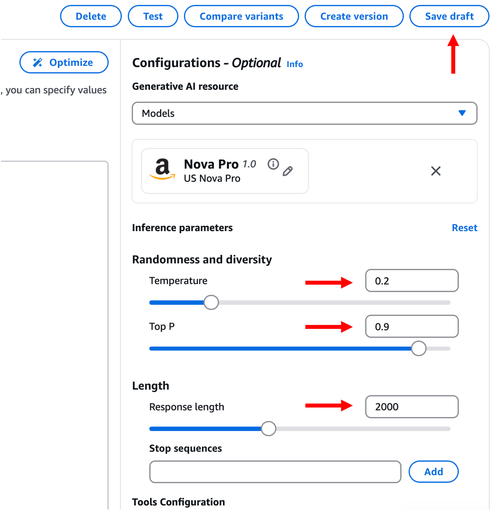
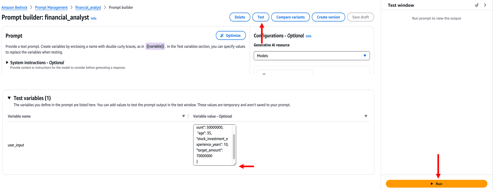
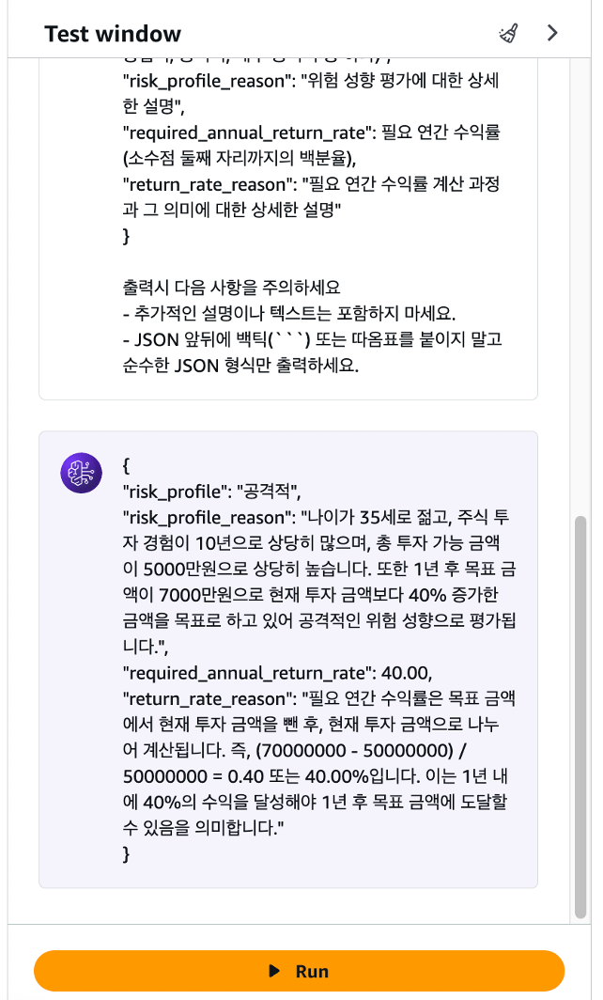
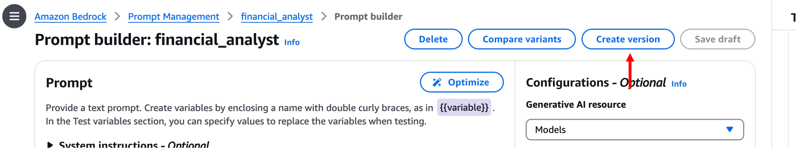

# 모듈 1-1. Prompt 생성



## Architecture

Amazon Bedrock Prompt Management를 이용하여 **재무 분석가 AI 모델을 위한 프롬프트**를 생성합니다.

---

## 실습 단계

### 1. Bedrock 콘솔 접속

AWS 콘솔에서 `Bedrock` 서비스를 검색하고 클릭합니다.



---

### 2. Prompt Management 진입

좌측 메뉴에서 **Prompt Management** 클릭 → **Create prompt** 클릭



---

### 3. 프롬프트 기본 정보 입력

- **Name**: `financial_analyst` (원하는 이름 지정 가능)



---

### 4. Prompt 내용 입력

Prompt 입력란에 아래 프롬프트 내용을 입력합니다:

```
당신은 재무분석 전문가입니다. 주어진 사용자 정보를 바탕으로 위험 성향을 평가하고 필요 연간 수익률을 계산하여 재무 분석 결과를 출력해야 합니다.

사용자 정보는 다음과 같은 JSON 형식으로 제공됩니다:
{
  "total_investable_amount": <총 투자 가능 금액>,
  "age": <나이>,
  "stock_investment_experience_years": <주식 투자 경험 연수>,
  "target_amount": <1년 후 목표 금액>
}

실제 사용자 정보:
{{user_input}}

분석 시 다음 사항을 고려하세요:
1. 위험 성향 평가:
- 나이, 투자 경험, 재무 상태, 목표 금액 들을 종합적으로 고려하여 위험 성향 평가
2. 필요 연간 수익률 계산:
- 계산 과정을 단계별로 명확히 보여주고, 각 단계를 설명하세요
- 계산된 수익률의 의미를 간단히 해석하세요

이 정보를 바탕으로 다음 형식에 맞춰 분석 결과를 JSON으로 출력하세요:
{
  "risk_profile": "위험 성향 평가 (매우 보수적, 보수적, 중립적, 공격적, 매우 공격적 중 하나)",
  "risk_profile_reason": "위험 성향 평가에 대한 상세한 설명",
  "required_annual_return_rate": 필요 연간 수익률 (소수점 둘째 자리까지의 백분율),
  "return_rate_reason": "필요 연간 수익률 계산 과정과 그 의미에 대한 상세한 설명"
}

출력시 다음 사항을 주의하세요:
- 추가적인 설명이나 텍스트는 포함하지 마세요.
- JSON 앞뒤에 백틱(```) 또는 따옴표를 붙이지 말고 순수한 JSON 형식만 출력하세요.
```



---

### 5. 모델 선택

**Select Model** 클릭 → **Amazon** 탭에서 **Nova Pro** 선택 → **Apply** 클릭



---

### 6. Inference Parameters 설정

- Temperature: `0.2`
- Top P: `0.9` (기본값)
- Length: `2000`

**Save draft** 클릭



---

### 7. 테스트 입력값 구성 및 실행

아래 테스트 변수 입력 후 **Test** 또는 **Run** 버튼 클릭:

```
{
  "total_investable_amount": 50000000,
  "age": 35,
  "stock_investment_experience_years": 10,
  "target_amount": 70000000
}
```




---

### 8. 버전 생성

**Create Version** 버튼 클릭



---

## 마무리

> 이제 재무 분석가 AI 모델을 위한 **Prompt 생성이 완료**되었습니다.  
> 다음 단계에서는 이 프롬프트를 실제로 활용하여 AI 모델 응답을 검증하고 적용합니다.
