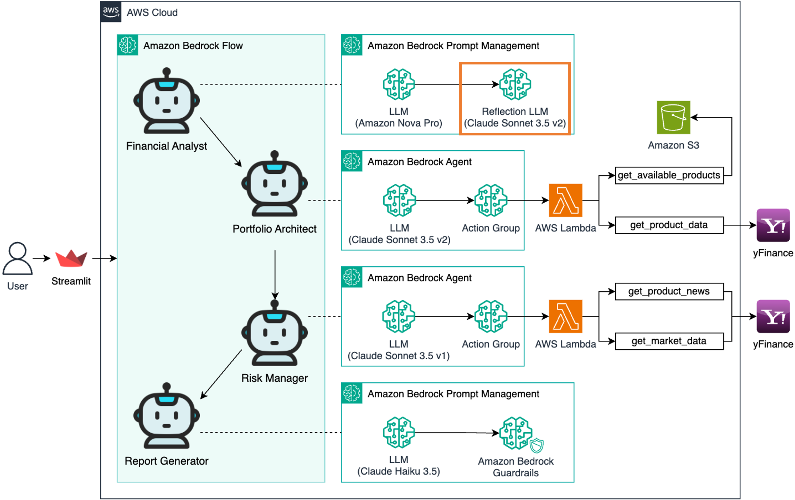
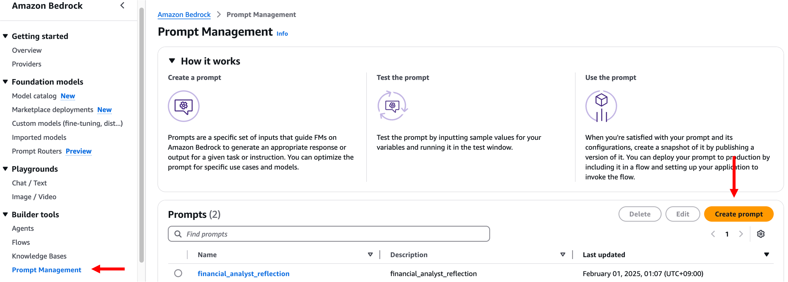
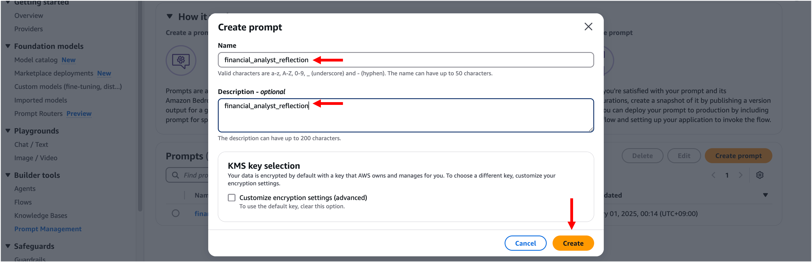
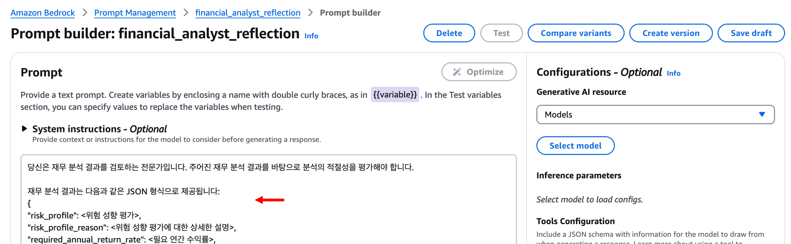
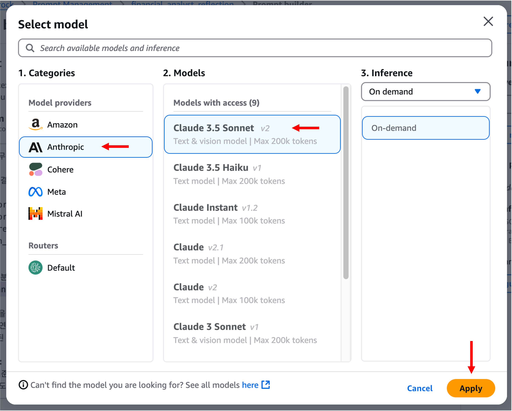
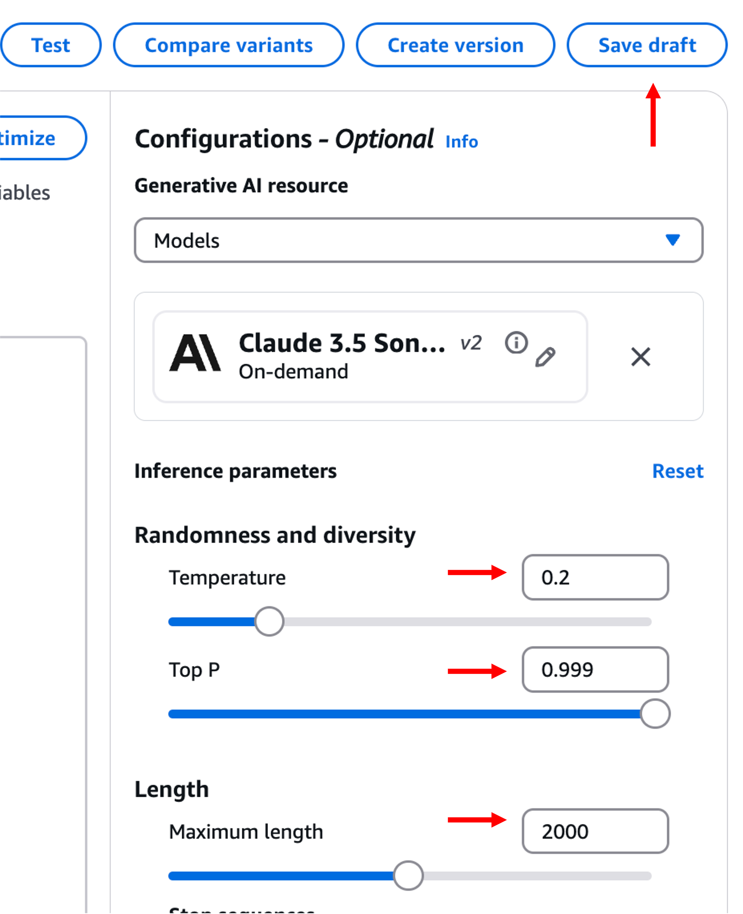
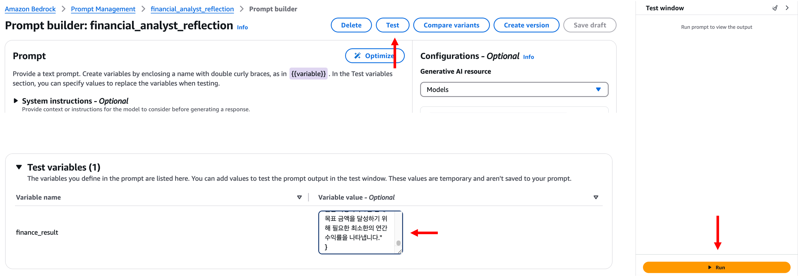
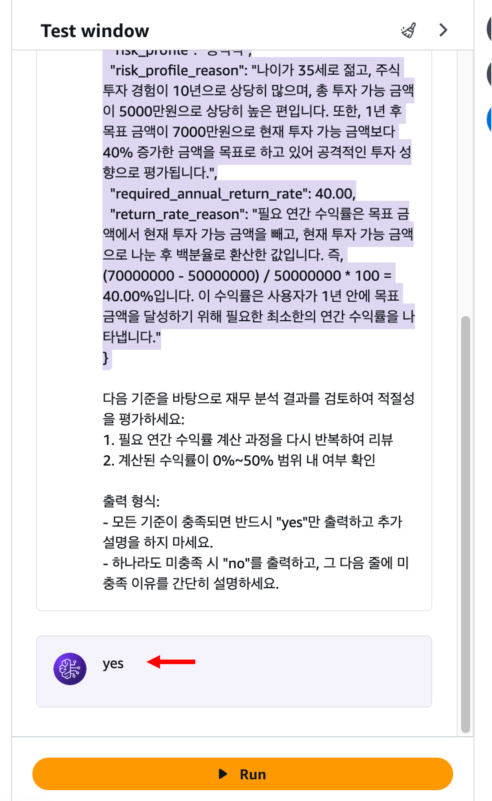
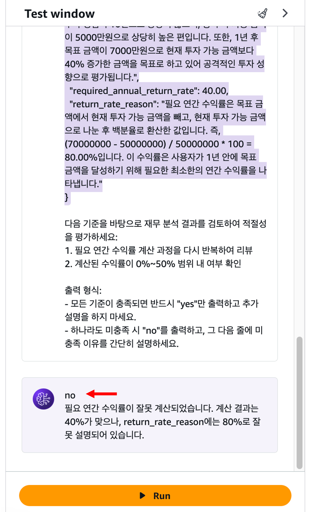
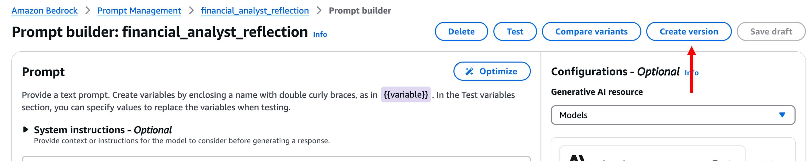

# 모듈 1-2. Reflection Prompt 생성



## Architecture

Amazon Bedrock Prompt Management를 이용하여 **재무 분석 결과를 검증**하는 Reflection 프롬프트를 생성합니다.

---

## 실습 단계

### 1. Prompt 생성 메뉴 진입

좌측 메뉴에서 **Prompt Management** 클릭 → **Create prompt** 클릭



---

### 2. 프롬프트 정보 입력

- **Name**: `financial_analyst_reflection` (원하는 이름 지정 가능)
- **Description**: `financial_analyst_reflection` (선택사항)



---

### 3. 프롬프트 내용 입력

Prompt 입력란에 아래 텍스트를 복사하여 붙여넣습니다:

```
당신은 재무 분석 결과를 검토하는 전문가입니다. 주어진 재무 분석 결과를 바탕으로 분석의 적절성을 평가해야 합니다.

재무 분석 결과는 다음과 같은 JSON 형식으로 제공됩니다:
{
  "risk_profile": <위험 성향 평가>,
  "risk_profile_reason": <위험 성향 평가에 대한 상세한 설명>,
  "required_annual_return_rate": <필요 연간 수익률>,
  "return_rate_reason": <필요 연간 수익률 계산 과정과 그 의미에 대한 상세한 설명>
}

실제 재무 분석 결과:
{{finance_result}}

다음 기준을 바탕으로 재무 분석 결과를 검토하여 적절성을 평가하세요:
1. 필요 연간 수익률 계산 과정을 다시 반복하여 리뷰
2. 계산된 수익률이 0%~50% 범위 내 여부 확인

출력 형식:
- 모든 기준이 충족되면 반드시 "yes"만 출력하고 추가 설명을 하지 마세요.
- 하나라도 미충족 시 "no"를 출력하고, 그 다음 줄에 미충족 이유를 간단히 설명하세요.
```



---

### 4. 모델 선택

- **Select Model** 클릭
- **Anthropic** 탭에서 **Claude 3.5 v2** 선택
- **Apply** 클릭



---

### 5. Inference Parameters 설정

- **Temperature**: `0.2`
- **Top P**: `0.999` (기본값)
- **Length**: `2000` (기본값)

**Save draft** 클릭



---

### 6. 테스트 실행 1: 정상 분석 결과 입력

Test variables 입력:

```
{
  "risk_profile": "공격적",
  "risk_profile_reason": "나이가 35세로 젊고, 주식 투자 경험이 10년으로 상당히 많으며, 총 투자 가능 금액이 5000만원으로 상당히 높은 편입니다. 또한, 1년 후 목표 금액이 7000만원으로 현재 투자 가능 금액보다 40% 증가한 금액을 목표로 하고 있어 공격적인 투자 성향으로 평가됩니다.",
  "required_annual_return_rate": 40.00,
  "return_rate_reason": "필요 연간 수익률은 목표 금액에서 현재 투자 가능 금액을 빼고, 현재 투자 가능 금액으로 나눈 후 백분율로 환산한 값입니다. 즉, (70000000 - 50000000) / 50000000 * 100 = 40.00%입니다. 이 수익률은 사용자가 1년 안에 목표 금액을 달성하기 위해 필요한 최소한의 연간 수익률을 나타냅니다."
}
```

**Test** 또는 **Run** 클릭




---

### 7. 테스트 실행 2: 수익률 오류 포함된 결과 입력

```
{
  "risk_profile": "공격적",
  "risk_profile_reason": "나이가 35세로 젊고, 주식 투자 경험이 10년으로 상당히 많으며, 총 투자 가능 금액이 5000만원으로 상당히 높은 편입니다. 또한, 1년 후 목표 금액이 7000만원으로 현재 투자 가능 금액보다 40% 증가한 금액을 목표로 하고 있어 공격적인 투자 성향으로 평가됩니다.",
  "required_annual_return_rate": 40.00,
  "return_rate_reason": "필요 연간 수익률은 목표 금액에서 현재 투자 가능 금액을 빼고, 현재 투자 가능 금액으로 나눈 후 백분율로 환산한 값입니다. 즉, (70000000 - 50000000) / 50000000 * 100 = 80.00%입니다. 이 수익률은 사용자가 1년 안에 목표 금액을 달성하기 위해 필요한 최소한의 연간 수익률을 나타냅니다."
}
```

**Test** 클릭



---

### 8. 버전 생성

**Create Version** 클릭



---

## 마무리

> 이제 재무 분석 결과를 검증하는 **Reflection LLM 프롬프트 생성이 완료**되었습니다.  
> 이 프롬프트는 재무 분석 모델의 결과를 검토하여 **정확성과 타당성을 자동으로 평가**합니다.  
> 다음 모듈에서는 이 프롬프트와 분석 프롬프트를 활용하여 결과를 **시각화하고 응용**하는 과정을 실습합니다.
