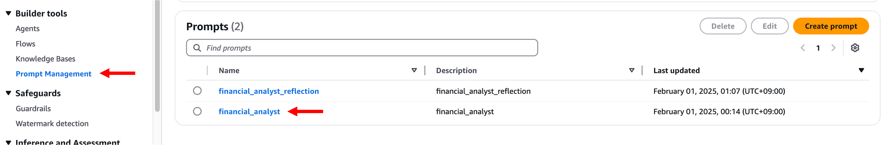
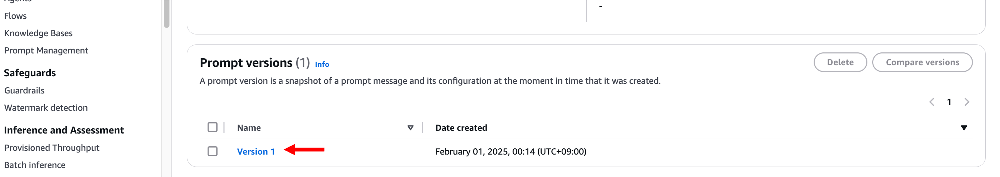
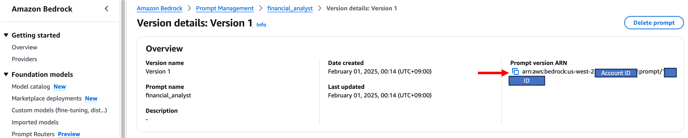
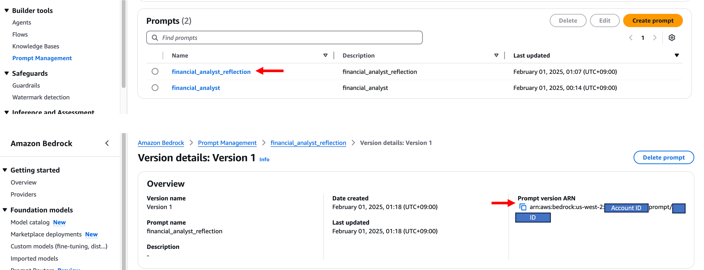
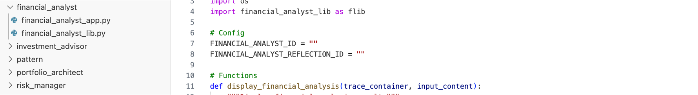
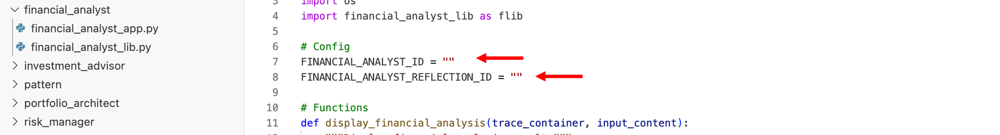
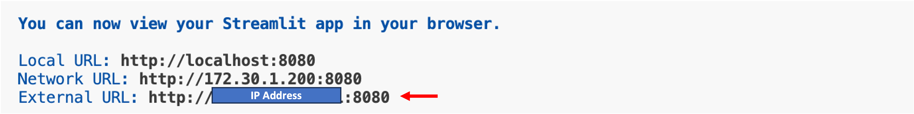
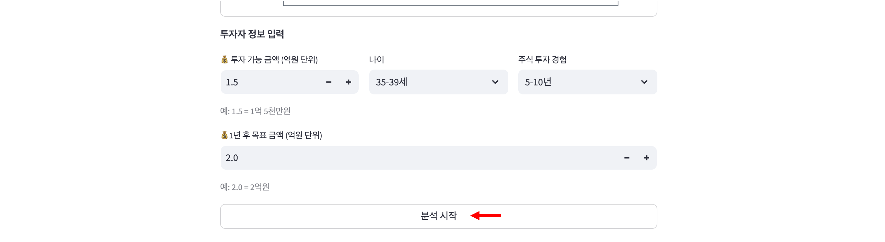
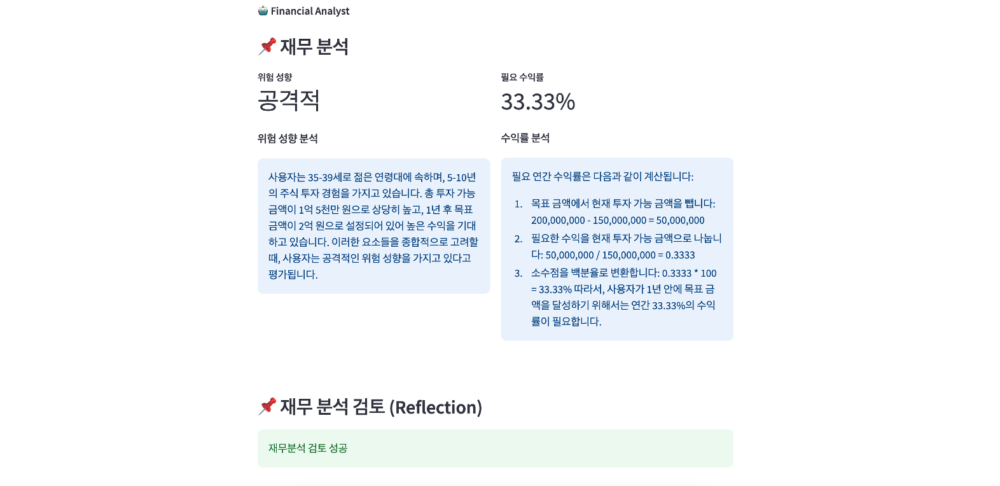
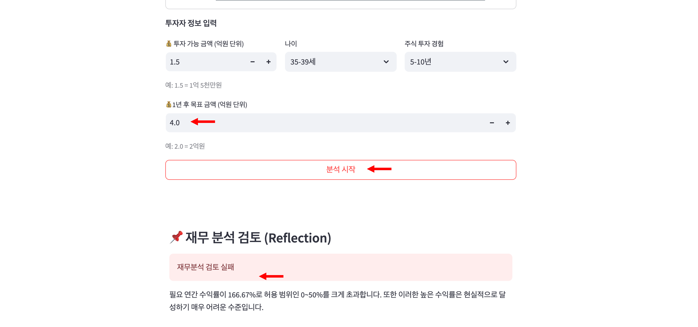

# 모듈 1-3. Streamlit 앱 실행


## Architecture

Streamlit 앱을 실행하여 **재무 분석가 모듈을 테스트**합니다.  
이 앱은 Amazon Bedrock Prompt를 통해 사용자 재무 정보를 분석하고, Reflection LLM으로 결과를 검증합니다.

---

## 실습 단계

### 1. 프롬프트 ARN 복사

#### 1-1. 분석 프롬프트 ARN 복사

- Bedrock 콘솔 → **Prompt Management** 메뉴 선택
- 생성한 `financial_analyst` 프롬프트 클릭



- **Prompt versions** 탭에서 `Version 1` 클릭



- **Overview** 탭에서 `Prompt version ARN` 복사 → 메모장 등에 저장



---

#### 1-2. Reflection 프롬프트 ARN 복사

- 동일한 방식으로 `financial_analyst_reflection` 프롬프트 선택 → `Version 1` 클릭  
- ARN 복사 → 메모장 등에 저장



---

### 2. VSCode 앱 파일 수정

- VSCode로 돌아가 경로 이동:

```
workshop/ko/financial_analyst/financial_analyst_app.py
```




- 다음 항목을 복사한 ARN 값으로 업데이트:

```
FINANCIAL_ANALYST_ID = "<복사한 financial_analyst ARN>"
FINANCIAL_ANALYST_REFLECTION_ID = "<복사한 financial_analyst_reflection ARN>"
```



---

### 3. Streamlit 앱 실행

VSCode에서 **Terminal > New Terminal** 선택 후 아래 명령어 입력:

```
cd ~/workshop/ko/financial_analyst
streamlit run financial_analyst_app.py --server.port 8080
```

> **External URL 주소가 출력되면 Command(⌘) 키와 함께 클릭하여 앱 실행**




---

### 4. 앱 사용 방법

- 재무 정보를 입력하고 **[분석 시작]** 버튼 클릭
- 결과가 생성될 때까지 기다립니다  
  > ⚠️ **응답 생성에 시간이 소요될 수 있습니다. 잠시만 기다려 주시기 바랍니다.**



---

### 5. 결과 확인

- 하단에 두 개의 결과 확인:
  - **Bedrock 기반 재무 분석 결과**
  - **Reflection LLM의 검증 결과**



---

### 6. 검증 테스트 (비정상 수익률)

- 목표금액을 **매우 높게 설정**하여 필요 수익률이 50%를 초과하도록 입력  
- **[분석 시작]** 클릭 → Reflection LLM이 "no"와 이유를 반환하는지 확인



---

### 7. 종료

앱 테스트 완료 후, 터미널에서 다음 키 입력:

```
Control + C
```

---

## 마무리

> 이제 **재무 분석가 모듈이 성공적으로 구현**되었습니다.  
> 사용자의 재무 정보를 분석하고, **Reflection 패턴을 통해 결과를 자동 검증**하여 더 신뢰성 있는 분석을 제공합니다.  
> 다음 Lab에서는 이 분석 결과를 바탕으로 **포트폴리오를 설계**하는 과정을 학습합니다.
