# 모듈 2-1. Lambda 함수 생성

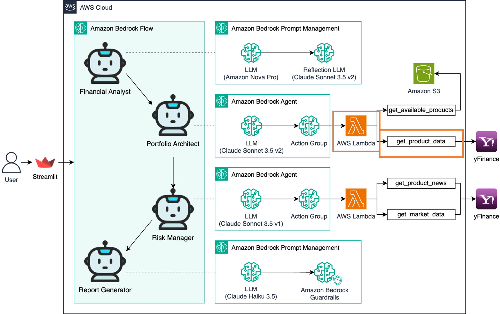

## Architecture

`yfinance` 패키지를 사용하여 실시간 금융 데이터를 수집할 수 있도록 **AWS Lambda 함수**를 생성합니다.  
이 함수는 **Bedrock Agent의 액션 그룹**과 연동되어 포트폴리오 설계에 필요한 데이터를 제공합니다.

---

## 실습 단계

### 1. Lambda 콘솔 접속

AWS 콘솔 상단 검색창에 `Lambda`를 입력하고 클릭합니다.

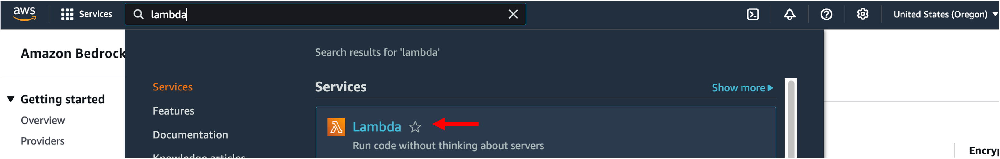

---

### 2. 함수 생성

- 좌측 메뉴에서 **Functions** 클릭
- **Create function** 클릭

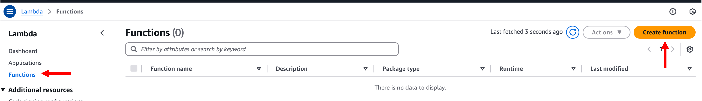

---

### 3. 함수 구성

다음과 같이 설정:

- **Author from scratch**
- **Function name**: `lambda-portfolio-architect`
- **Runtime**: `Python 3.12`
- **Architecture**: `x86_64`
- **Permissions**: 기본값 유지 – `Create a new role with basic Lambda permissions`

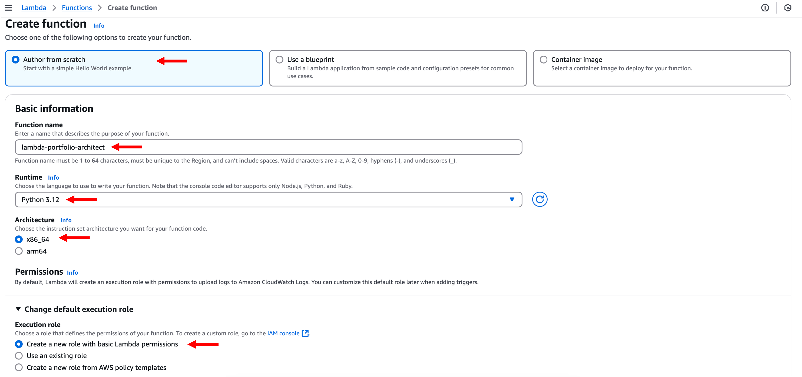

**Create function** 클릭

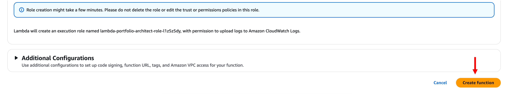

---

### 4. 코드 작성

**Code 탭 > Code source** 영역에 아래 코드를 붙여넣습니다:

```
import os  
import json  
import yfinance as yf  
import boto3  
from datetime import datetime, timedelta  

s3 = boto3.client('s3')  

def get_named_parameter(event, name):  
    for param in event['parameters']:  
        if param['name'] == name:  
            return param['value']  
    return None  

def get_available_products():  
    bucket_name = os.environ['S3_BUCKET_NAME']  
    file_name = 'available_products.json'  

    try:  
        response = s3.get_object(Bucket=bucket_name, Key=file_name)  
        content = response['Body'].read().decode('utf-8')  
        products = json.loads(content)  
        return products  
    except Exception as e:  
        print(f"Error reading from S3: {e}")  
        return {"error": str(e)}  

def get_product_data(ticker):  
    try:  
        end_date = datetime.today().date()  
        start_date = end_date - timedelta(days=100)  

        product_data = {}  
        etf = yf.Ticker(ticker)  
        hist = etf.history(start=start_date, end=end_date)  

        product_data[ticker] = {  
            date.strftime('%Y-%m-%d'): round(price, 2) for date, price in hist['Close'].items()  
        }  

        return product_data  
    except Exception as e:  
        print(f"Error fetching asset prices: {e}")  
        return {"error": str(e)}  

def lambda_handler(event, context):  
    action_group = event.get('actionGroup', '')  
    message_version = event.get('messageVersion', '')  
    function = event.get('function', '')  

    if function == 'get_available_products':  
        output = get_available_products()  
    elif function == 'get_product_data':  
        ticker = get_named_parameter(event, "ticker")  
        output = get_product_data(ticker)  
    else:  
        output = 'Invalid function'  

    action_response = {  
        'actionGroup': action_group,  
        'function': function,  
        'functionResponse': {  
            'responseBody': {'TEXT': {'body': json.dumps(output, ensure_ascii=False)}}  
        }  
    }  

    function_response = {'response': action_response, 'messageVersion': message_version}  
    print("Response: {}".format(function_response, ensure_ascii=False))  

    return function_response  
```

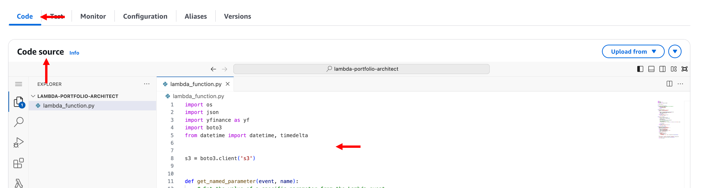

**Deploy** 클릭

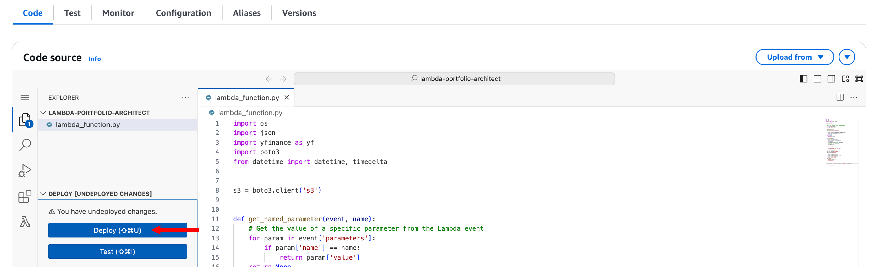

---

### 5. yfinance Layer 연결

- **Code 탭 하단 → Layers → Add a layer** 클릭

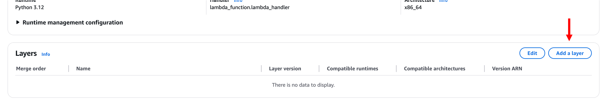

- **Choose a layer** 설정:
  - Custom layers
  - Layer: `yfinance-layer` (이전 모듈에서 생성한 Layer)
  - Version: 최신 버전 선택

**Add** 클릭

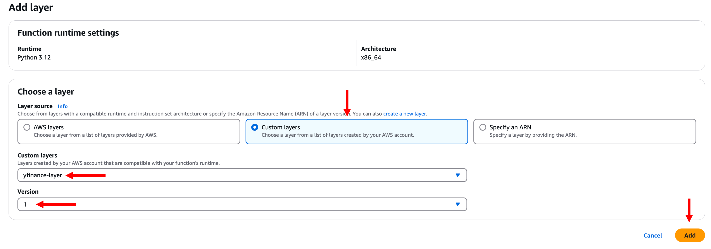

---

### 6. Timeout 설정 변경

- **Configuration > General configuration** 클릭
- **Edit** 클릭
- **Timeout**: `10초`로 변경 → **Save**

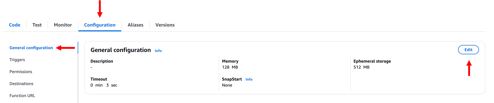
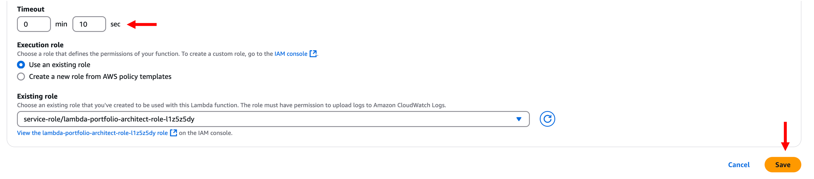

---

### 7. 함수 테스트

- **Test** 탭 클릭

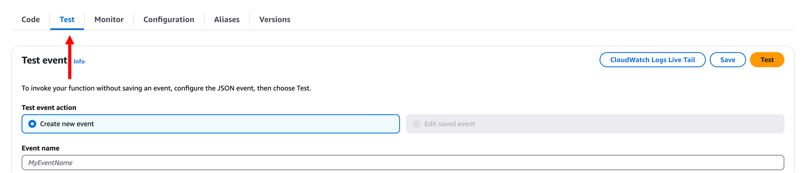

- Create new event
  - **Event name**: `test_product_data`
  - **Event JSON**:

```
{
  "actionGroup": "InvestmentActions",
  "function": "get_product_data",
  "parameters": [
    {
      "name": "ticker",
      "type": "string",
      "value": "SPY"
    }
  ]
}
```

**Test** 클릭

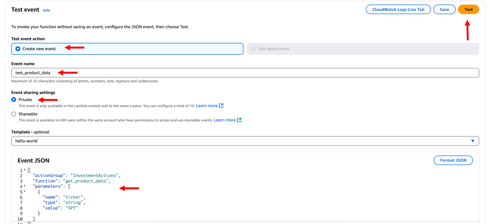

---

### 8. 결과 확인

- **Status: Succeeded** 메시지가 출력되면 Lambda 함수가 정상 실행된 것입니다.

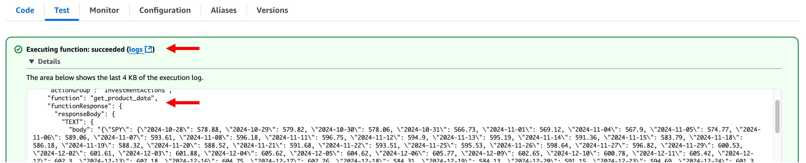

---

## 마무리

> 이제 포트폴리오 설계를 위한 Lambda 함수가 성공적으로 생성되었습니다.  
> 이 Lambda는 Bedrock Agent의 액션 그룹과 연동되어 **ETF 가격 데이터 및 상품 목록을 제공**하게 됩니다.  
> 다음 모듈에서는 이 Lambda 함수가 접근하는 **S3 설정 및 환경 변수**를 구성합니다.
