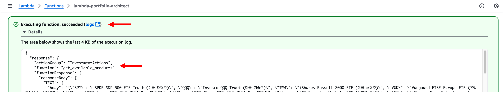

# 모듈 2-2. Lambda S3 접근 설정


## Architecture

Lambda 함수에 S3 버킷 접근 권한을 부여하고, 필요한 환경 변수를 설정합니다.  
이 설정을 통해 포트폴리오 구성에 필요한 **투자 상품 정보를 S3에서 읽을 수 있게 됩니다**.

---

## 실습 단계

### 1. S3 버킷 이름 복사

- **Amazon S3** 서비스 → 앞서 생성한 버킷 클릭
- 버킷 이름을 **메모장 등에 저장**


---

### 2. Lambda 함수 선택

- Lambda 콘솔 → 좌측 메뉴에서 **Functions** 클릭
- `lambda-portfolio-architect` 함수 클릭


---

### 3. 환경 변수 추가

- **Configuration 탭 > Environment variables** 로 이동
- **Edit** 클릭 → **Add environment variable** 버튼 클릭

- 설정:
  - **Key**: `S3_BUCKET_NAME`
  - **Value**: (앞서 복사한 S3 버킷 이름)

**Save** 클릭


---

### 4. Lambda IAM Role 접근

- **Configuration > Permissions** 하단에서 **Execution role** 클릭 → IAM 콘솔로 이동


---

### 5. Inline Policy 생성

- **Permissions > Permissions policies** 섹션에서  
  **Add permissions → Create inline policy** 클릭


- **JSON** 탭 선택 후 아래 정책 입력:

```
{
    "Version": "2012-10-17",
    "Statement": [
        {
            "Effect": "Allow",
            "Action": [
                "s3:GetObject"
            ],
            "Resource": "arn:aws:s3:::{S3_BUCKET_NAME}/*"
        }
    ]
}
```

> `{S3_BUCKET_NAME}`에는 메모장에 저장한 S3 버킷 이름을 입력하세요.

**Next** 클릭


---

### 6. 정책 이름 지정 및 생성

- **Policy name**: `s3-getobject`
- **Create policy** 클릭


정책이 성공적으로 추가되면 IAM 설정을 완료하고 Lambda로 돌아갑니다.


---

### 7. Lambda 함수 테스트

- Lambda 함수 **Test** 탭 클릭


- 테스트 이벤트 설정:

  - **Event name**: `test_available_products`
  - **Event JSON**:

```
{
  "actionGroup": "InvestmentActions",
  "function": "get_available_products"
}
```

- **Test** 클릭


---

### 8. 결과 확인

- 함수 실행 결과가 `Succeeded` 로 나타나면 성공



---

## 마무리

> 이제 Lambda 함수가 S3 버킷에서 **투자 상품 데이터를 읽을 수 있는 권한과 환경 변수 설정이 완료**되었습니다.  
> 다음 모듈에서는 이 Lambda 함수와 Bedrock Agent를 연동하여 액션 그룹을 구성합니다.
