# 모듈 2-3. Bedrock Agent 생성

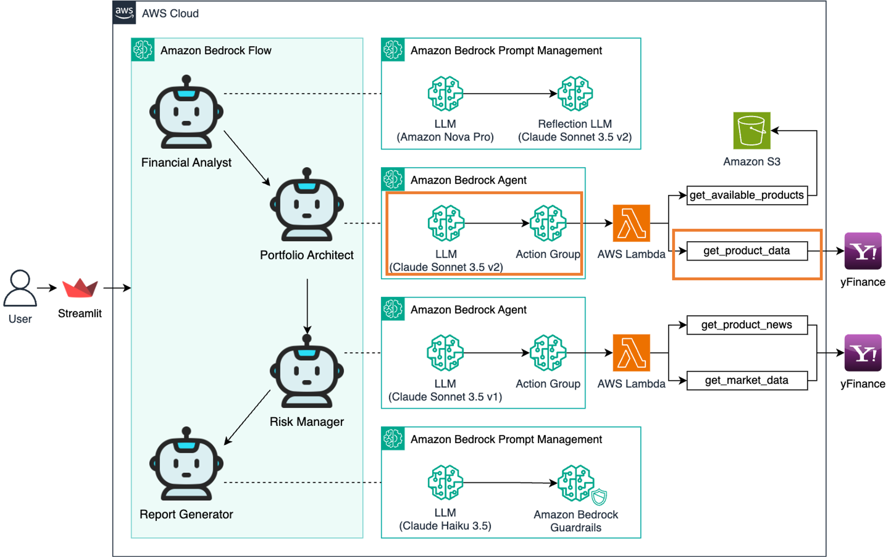

## Architecture

Bedrock Agent를 생성하고, 포트폴리오 설계에 필요한 **Action Group**을 설정합니다.  
이 Agent는 사용자의 재무 정보를 바탕으로 맞춤형 **투자 포트폴리오**를 설계합니다.

---

## 실습 단계

### 1. Bedrock 콘솔 접속

AWS 콘솔에서 `Bedrock`을 검색하고 클릭합니다.

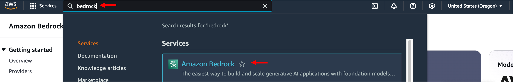

---

### 2. Agent 생성

- 좌측 메뉴에서 **Agents** 선택
- **Create Agent** 클릭

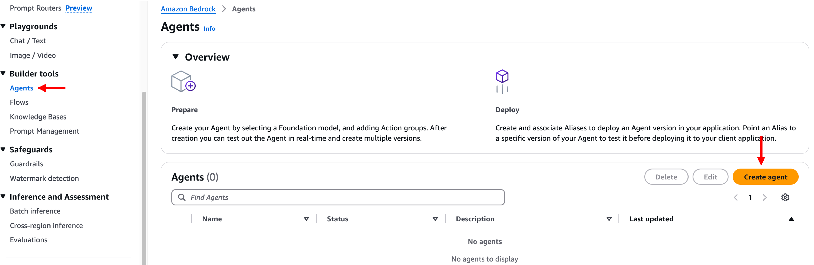

---

### 3. Agent 기본 정보 입력

- **Name**: `portfolio_architect` (원하는 이름 지정 가능)
- **Description**: `portfolio_architect` (선택 사항)

**Create** 클릭

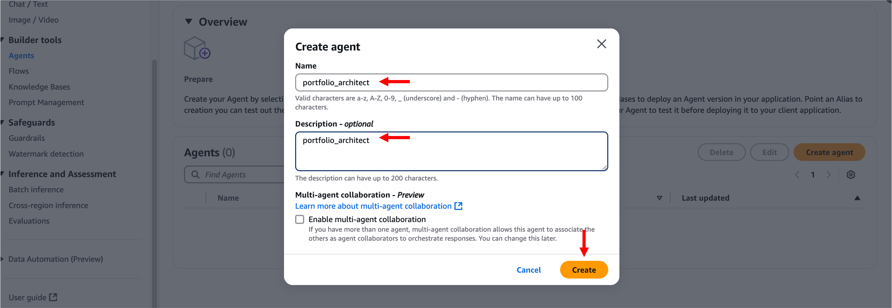

---

### 4. Agent 세부 설정

- **Agent resource role**: Create and use a new service role
- **Select model**: Anthropic Claude 3.5 Sonnet v2
- **Instructions for the Agent**:

```
당신은 전문 투자 설계사입니다. 고객의 재무 분석 결과를 바탕으로 구체적인 투자 포트폴리오를 제안해야 합니다. 

입력 데이터:
재무 분석 결과가 다음과 같은 JSON 형식으로 제공됩니다:
{
  "risk_profile": <위험 성향>,
  "risk_profile_reason": <위험 성향 평가 근거>,
  "required_annual_return_rate": <필요 연간 수익률>,
  "return_rate_reason": <필요 수익률 계산 근거 및 설명>
}

당신의 작업:
1. 재무 분석 결과를 신중히 검토하고 해석하세요.
2. "get_available_products" 액션을 호출하여 사용 가능한 투자 상품 목록을 얻으세요. 각 상품은 "ticker: 설명" 형식으로 제공됩니다.
3. 얻은 투자 상품 목록 중 분산 투자를 고려하여 고객의 재무 분석 결과와 가장 적합한 3개의 상품을 선택하세요.
4. 선택한 각 투자 상품에 대해 "get_product_data" 액션을 동시에 호출하여 최근 가격 데이터를 얻으세요.
5. 얻은 가격 데이터를 분석하여 최종 포트폴리오 비율을 결정하세요. 이때 고객의 재무 분석 결과를 균형있게 고려하세요.
6. 포트폴리오 구성 근거를 상세히 설명하세요.

다음 JSON 형식으로 응답해주세요:
{
  "portfolio_allocation": {투자 상품별 배분 비율},
  "strategy": "투자 전략 설명",
  "reason": "포트폴리오 구성 근거"
}

응답 시 다음 사항을 고려하세요:
- 제안한 포트폴리오가 고객의 투자 목표 달성에 어떻게 도움이 될 것인지 논리적으로 설명하세요.
- 각 자산의 배분 비율은 반드시 정수로 표현하고, 총합이 100%가 되어야 합니다.
- 포트폴리오 구성 근거를 작성할 때는 반드시 "QQQ(미국 기술주)"처럼 티커와 설명을 함께 제공하세요.
```

**Save** 클릭

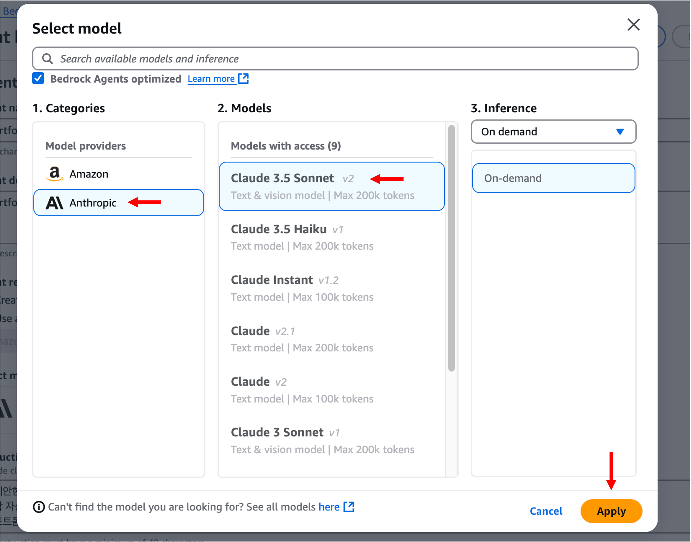
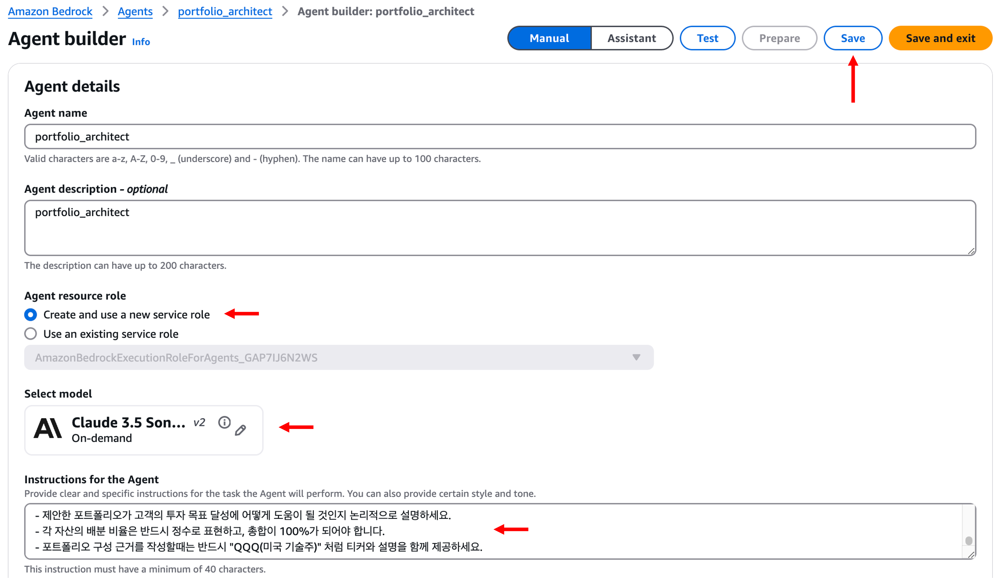

---

### 5. Action Group 추가

- **Action groups** 섹션 → **Add** 클릭

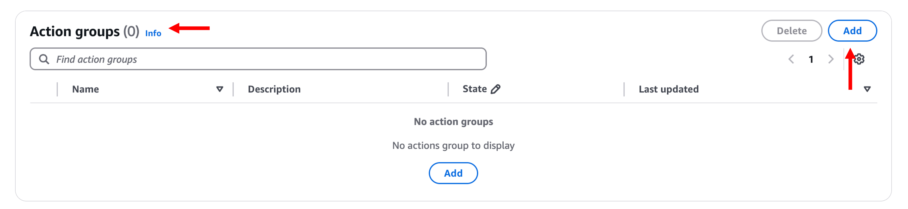

---

### 6. Action Group 기본 정보

- **Name**: `action-group-portfolio-architect` (원하는 이름 지정 가능)
- **Description**: (선택 사항)

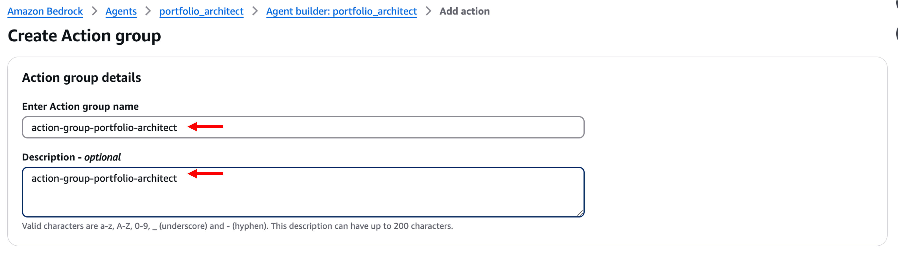

---

### 7. Lambda 함수 연동

- **Define with function details** 선택
- **Select Lambda function**: `lambda-portfolio-architect`
- **Function version**: `LATEST`

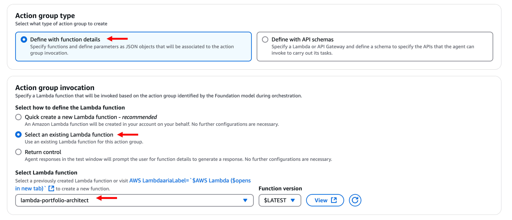

---

### 8. Action Group Function 1 설정 (get_product_data)

- **Name**: `get_product_data`
- **Description**: 선택한 투자 상품의 최근 가격 데이터를 조회합니다.
- **Parameters**:
  - **Name**: `ticker`
  - **Type**: `String`
  - **Required**: `True`

**Enable confirmation**: Disabled

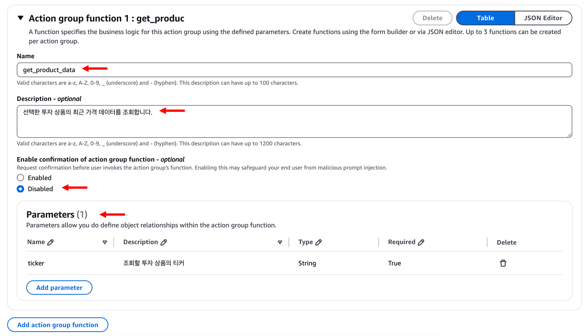

---

### 9. Action Group Function 2 설정 (get_available_products)

- **Name**: `get_available_products`
- **Description**: 사용 가능한 투자 상품 목록을 조회합니다.
- **Parameters**: 없음

**Create** 클릭

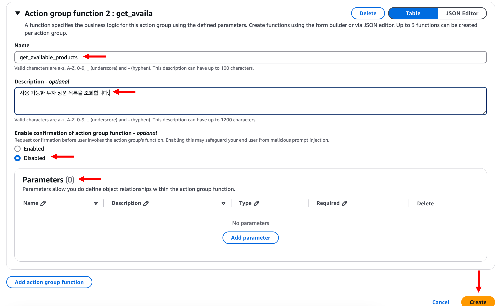

---

### 10. 생성 완료

- Action Group 목록에서 추가된 항목 확인
- **Save and exit** 클릭

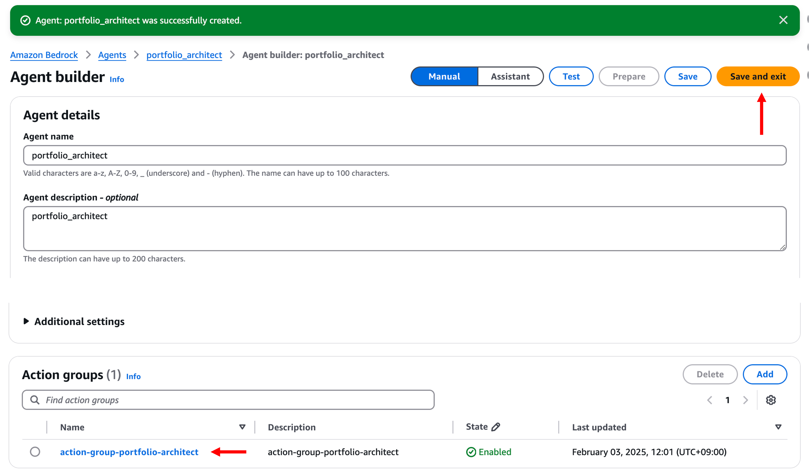

---

## 마무리

> 이제 **포트폴리오 설계를 위한 Bedrock Agent 및 Action Group**이 성공적으로 생성되었습니다.  
> 다음 모듈에서는 이 Agent가 사용할 Lambda 함수에 대한 **권한 부여 및 Alias 설정**을 진행합니다.
