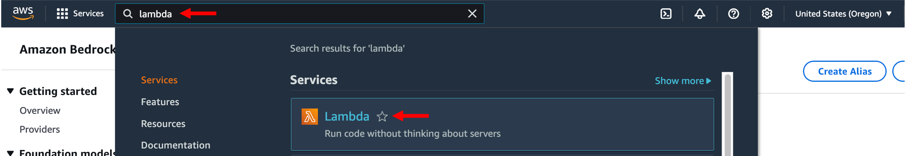
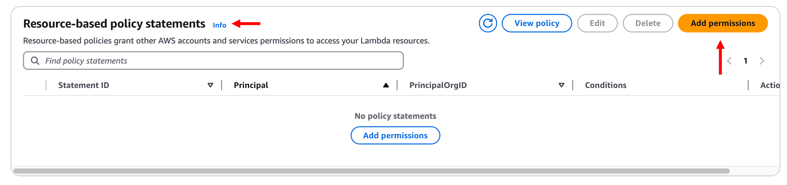
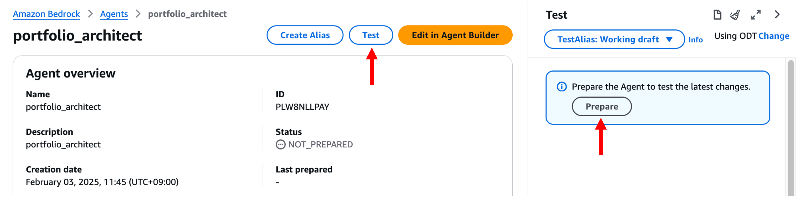
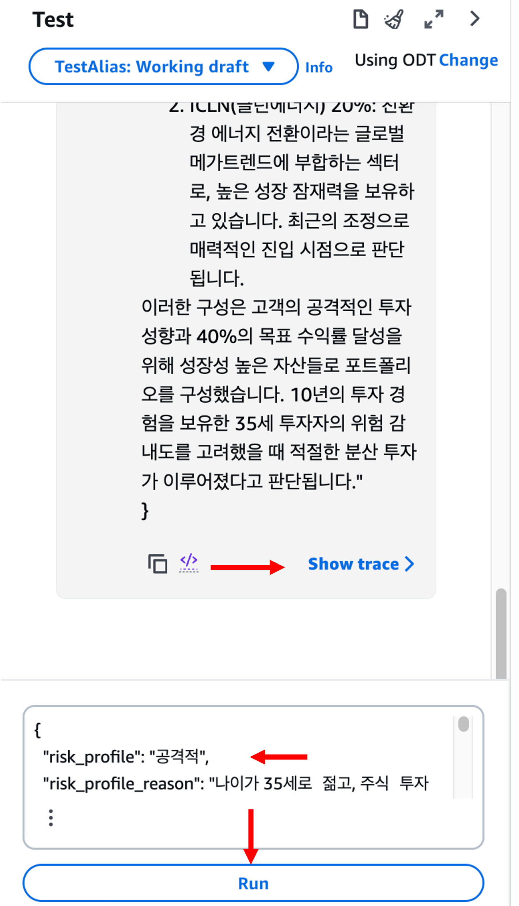

# 모듈 2-4. Lambda 권한 설정 및 별칭 생성


## Architecture

Lambda 함수에 Bedrock Agent의 **invoke 권한**을 추가하고,  
Agent의 **Alias**를 생성하여 **버전 관리 및 안정적 배포**를 지원합니다.  
이후 Bedrock Agent와 Lambda Action Group 간의 연결을 테스트합니다.

---

## 실습 단계

### 1. Bedrock Agent ARN 복사

- Bedrock 서비스 → **Agents** 메뉴 클릭
- 생성한 에이전트 `portfolio-architect` 클릭
- 상단의 **Agent ARN** 복사 → 메모장 등에 저장


---

### 2. Lambda 콘솔로 이동

- AWS 콘솔 → `Lambda` 검색 → 클릭



- 좌측 메뉴에서 **Functions** 클릭
- `lambda-portfolio-architect` 함수 클릭


---

### 3. 권한 추가

- **Configuration** 탭 → **Permissions** 클릭
- **Resource-based policy statements** 섹션에서 **Add permissions** 클릭




---

### 4. Bedrock Agent에 invoke 권한 부여

다음과 같이 설정:

- **Service**: `Other`
- **Statement ID**: `allow-bedrock-agent`
- **Principal**: `bedrock.amazonaws.com`
- **Source ARN**: 복사한 **Agent ARN**
- **Action**: `lambda:InvokeFunction`

**Save** 클릭


---

### 5. Bedrock Agent 테스트

- Bedrock 콘솔 → **Agents** 메뉴
- `portfolio-architect` 선택




입력 예시:

```
{
  "risk_profile": "공격적",
  "risk_profile_reason": "나이가 35세로 젊고, 주식 투자 경험이 10년으로 상당히 많으며, 총 투자 가능 금액이 5000만원으로 상당히 높은 편입니다. 또한, 1년 후 목표 금액이 7000만원으로 현재 투자 가능 금액보다 40% 증가한 금액을 목표로 하고 있어 공격적인 투자 성향으로 평가됩니다.",
  "required_annual_return_rate": 40.00,
  "return_rate_reason": "필요 연간 수익률은 목표 금액에서 현재 투자 가능 금액을 빼고, 현재 투자 가능 금액으로 나눈 후 백분율로 환산한 값입니다. 즉, (70000000 - 50000000) / 50000000 * 100 = 80.00%입니다. 이 수익률은 사용자가 1년 안에 목표 금액을 달성하기 위해 필요한 최소한의 연간 수익률을 나타냅니다."
}
```

> ⚠️ **응답 생성에 시간이 소요될 수 있습니다. 잠시 기다려 주세요.**



---

### 6. Agent 별칭 생성

- Agent 화면 상단 → **Create alias** 클릭


설정:

- **Alias**: `portfolio-architect-demo`
- **Description**: 선택 사항
- **버전 연결**: `Create a new version and associate it to this alias`
- **Throughput**: `On-demand`

**Create alias** 클릭


---

### 7. 별칭 확인

- 생성된 별칭이 목록에 표시되는지 확인


---

## 마무리

> 이제 **Lambda 함수에 대한 invoke 권한 부여**와  
> Bedrock Agent의 **버전 관리용 별칭(alias) 생성**이 완료되었습니다.  
> 다음 모듈에서는 이 설정을 바탕으로 **Streamlit 기반의 포트폴리오 설계 앱을 구현**합니다.
