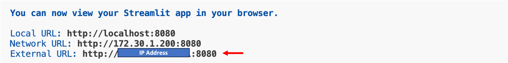

# 모듈 2-5. 간소화된 앱 실행

## Architecture

Streamlit 앱을 실행하여 Bedrock Agent(`portfolio-architect`)의 기능을 검증합니다.  
이 앱은 재무 분석 결과(JSON)를 기반으로 포트폴리오를 설계하며, Bedrock Agent와 Lambda Action Group의 연동이 정상적으로 작동하는지 확인합니다.

---

## 실습 단계

### 1. Agent 및 Alias ID 복사

- AWS 콘솔 → Bedrock → **Agents** 메뉴
- `portfolio-architect` 클릭

복사할 항목:
- **Agent ID**
- **Alias ID**

> 메모장 등에 저장해둡니다.

  


---

### 2. Streamlit 앱 파일 수정

- VSCode에서 다음 경로로 이동:
  
```
cd ~/workshop/ko/portfolio_architect
```

- `portfolio_architect_app.py` 파일을 엽니다.


- 다음 부분을 수정:

```
PORTFOLIO_ARCHITECT_AGENT_ID = "복사한 Agent ID"
PORTFOLIO_ARCHITECT_AGENT_ALIAS_ID = "복사한 Alias ID"
```


---

### 3. Streamlit 앱 실행

터미널에서 다음 명령어 입력:

```
streamlit run portfolio_architect_app.py --server.port 8080
```


앱이 실행되면 **외부 URL 주소**를 클릭하여 웹 브라우저로 접속합니다.

---

### 4. 분석 JSON 입력 및 실행

아래 JSON을 **입력창에 그대로 붙여넣기** 후 `분석 시작` 버튼 클릭:

```
{
  "risk_profile": "공격적",
  "risk_profile_reason": "나이가 35세로 젊고, 주식 투자 경험이 10년으로 상당히 많으며, 총 투자 가능 금액이 5000만원으로 상당히 높은 편입니다. 또한, 1년 후 목표 금액이 7000만원으로 현재 투자 가능 금액보다 40% 증가한 금액을 목표로 하고 있어 공격적인 투자 성향으로 평가됩니다.",
  "required_annual_return_rate": 40.00,
  "return_rate_reason": "필요 연간 수익률은 목표 금액에서 현재 투자 가능 금액을 빼고, 현재 투자 가능 금액으로 나눈 후 백분율로 환산한 값입니다. 즉, (70000000 - 50000000) / 50000000 * 100 = 80.00%입니다. 이 수익률은 사용자가 1년 안에 목표 금액을 달성하기 위해 필요한 최소한의 연간 수익률을 나타냅니다."
}
```

> ⚠️ **응답 생성에 시간이 소요될 수 있습니다. 잠시 기다려 주세요.**

---

### 5. 결과 확인

- **포트폴리오 구성**: 티커별 투자 비율
- **투자 전략 설명**
- **구성 근거 설명**
- **추론 정보 (Trace)** 확인 가능

  


---

### 6. 앱 종료

- 브라우저 탭을 닫고
- 터미널에서 `Ctrl + C` 입력하여 앱 종료

---

## 요약

이제 `portfolio-architect` Agent와 연동된 Lambda, Action Group, Streamlit UI가 정상 작동하는지 검증이 완료되었습니다.  
이 모듈은 사용자의 투자 정보와 시장 데이터를 바탕으로 **개인화된 포트폴리오 설계**를 자동화합니다.

> ✅ 다음 실습에서는 이 결과를 활용해 **자산 운용 전략을 수립 및 전달**하는 프로세스를 구현합니다.
