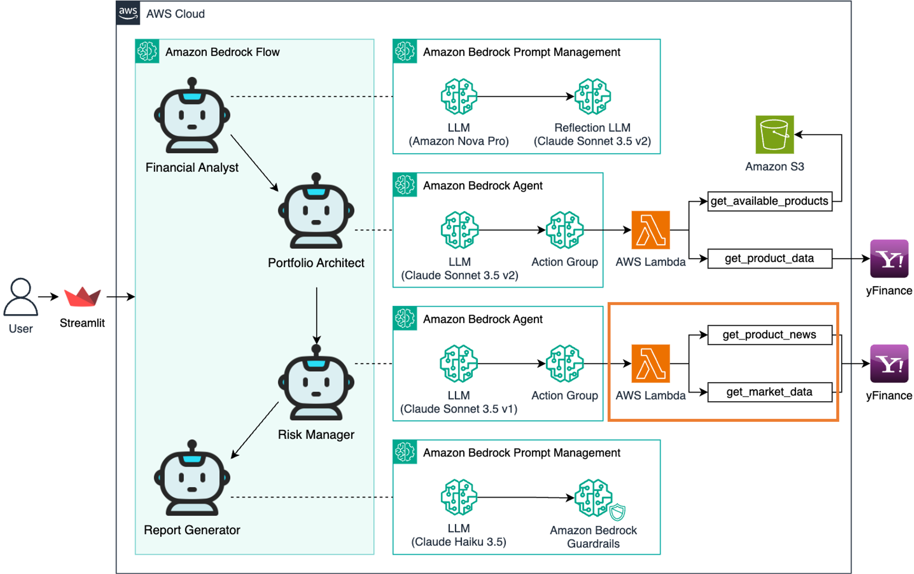
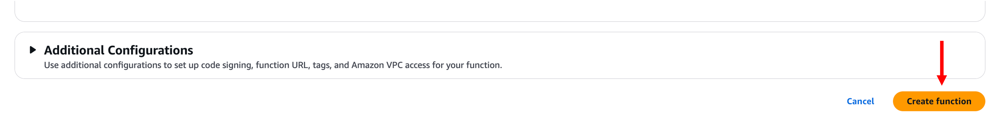

# 모듈 3-1. Lambda 함수 생성



## Architecture

뉴스 데이터를 수집하고 분석할 수 있는 AWS Lambda 함수를 설정합니다.  
이 Lambda 함수는 Bedrock Agent의 액션 그룹과 연동되어 리스크 분석에 필요한 데이터를 제공합니다.

---

## 실습

### 1. Lambda 함수 생성

- AWS 콘솔 → Lambda 서비스 검색 → 클릭
- 좌측 메뉴: **Functions**
- **Create function** 클릭

설정:
- Author from scratch
- Function name: `lambda-risk-manager`
- Runtime: Python 3.12
- Architecture: x86_64
- Permissions: 기본 설정 (새 역할 생성)



---

### 2. 코드 작성

- 생성된 함수의 **Code** 탭 → Code source에 아래 코드 입력 후 저장:

```
import json
import yfinance as yf

def get_named_parameter(event, name):
    for param in event['parameters']:
        if param['name'] == name:
            return param['value']
    return None

def get_product_news(ticker, top_n=5):
    try:
        stock = yf.Ticker(ticker)
        news = stock.news[:top_n]

        formatted_news = []
        for item in news:
            content = item.get("content", "")
            news_item = {
                "title": content.get("title", ""),
                "summary": content.get("summary", ""),
                "publish_date": content.get("pubDate", "")[:10]
            }
            formatted_news.append(news_item)

        result = {
            "ticker": ticker,
            "news": formatted_news,
        }

        return result

    except Exception as e:
        print(f"Error fetching news for {ticker}: {e}")
        return {"error": str(e)}

def get_market_data():
    try:
        market_info = {
            "us_dollar_index": {"ticker": "DX-Y.NYB", "description": "미국 달러 강세를 나타내는 지수"},
            "us_10y_treasury_yield": {"ticker": "^TNX", "description": "미국 10년 국채 수익률 (%)"},
            "us_2y_treasury_yield": {"ticker": "2YY=F", "description": "미국 2년 국채 수익률 (%)"},
            "vix_volatility_index": {"ticker": "^VIX", "description": "시장의 변동성을 나타내는 VIX 지수"},
            "crude_oil_price": {"ticker": "CL=F", "description": "WTI 원유 선물 가격 (USD/배럴)"}
        }

        data = {}
        for key, info in market_info.items():
            ticker = yf.Ticker(info["ticker"])
            market_price = ticker.info.get('regularMarketPreviousClose', 0)

            data[key] = {
                "description": info["description"],
                "value": round(market_price, 2)
            }

        return data

    except Exception as e:
        print(f"Error fetching market data: {e}")
        return {"error": str(e)}

def lambda_handler(event, context):
    action_group = event.get('actionGroup', '')
    message_version = event.get('messageVersion', '')
    function = event.get('function', '')

    if function == 'get_product_news':
        ticker = get_named_parameter(event, "ticker")
        output = get_product_news(ticker)
    elif function == 'get_market_data':
        output = get_market_data()
    else:
        output = 'Invalid function'

    action_response = {
        'actionGroup': action_group,
        'function': function,
        'functionResponse': {
            'responseBody': {'TEXT': {'body': json.dumps(output, ensure_ascii=False)}}
        }
    }

    function_response = {'response': action_response, 'messageVersion': message_version}
    print("Response: {}".format(json.dumps(function_response, ensure_ascii=False)))

    return function_response
```


---

### 3. Layer 연결

- **Code 탭** 하단 → **Layers** → Add a layer

설정:
- Custom layers: 기존 yfinance-layer 선택
- Version: 최신


---

### 4. 테스트 이벤트 설정


**Test 1: 뉴스**

```
{
  "actionGroup": "InvestmentActions",
  "function": "get_product_news",
  "parameters": [
    {
      "name": "ticker",
      "type": "string",
      "value": "SPY"
    }
  ]
}
```

**Test 2: 시장 지표**

```
{
  "actionGroup": "InvestmentActions",
  "function": "get_market_data"
}
```

> ✅ `Status: Succeeded`가 표시되면 정상 작동


---

## 요약

이제 `lambda-risk-manager` 함수가 생성되었으며, 다음 기능을 제공합니다:

- 특정 자산에 대한 최신 뉴스 5개 수집
- 주요 거시경제 지표(달러, 금리, VIX, 원유 등) 수집

> 이후 모듈에서는 이 Lambda 함수를 **Bedrock Agent와 연동하여 리스크 분석 Agent**를 구축합니다.
