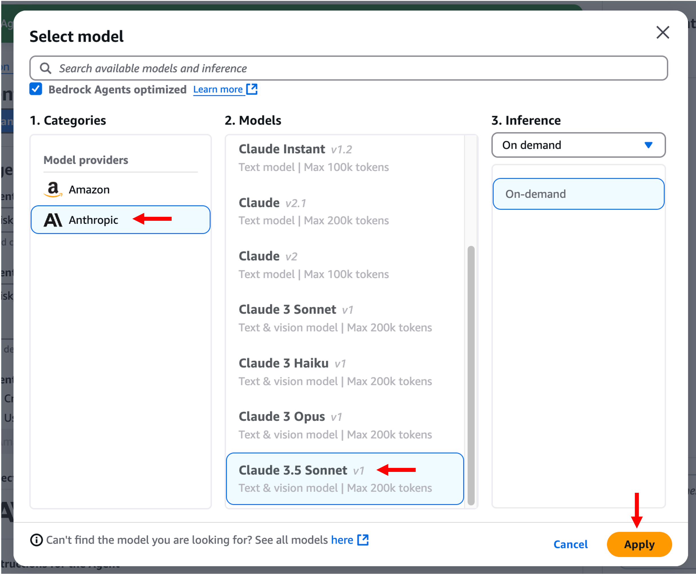

# 모듈 3-2. Bedrock Agent 생성


## Architecture

Bedrock Agent를 생성하고, 리스크 관리에 필요한 Action Group을 설정합니다.  
이 Agent는 **Planning 패턴**을 적용하여 도구들을 자율적으로 조합해 리스크 분석을 수행합니다.

---

## 실습

### 1. Bedrock Agent 생성

1. AWS 콘솔 → **Bedrock 서비스** 검색 및 클릭  

2. 좌측 메뉴에서 **Agents** → **Create Agent** 클릭

설정:
- **Name**: `risk_manager` (원하는 이름 가능)
- **Description**: `risk_manager` (선택 사항)


---

### 2. Agent Details 설정

- **Agent resource role**: Create and use a new service role
- **Select model**: Anthropic Claude 3.5 Sonnet v1
- **Instructions**:
  아래 프롬프트 입력

```
당신은 리스크 관리 전문가입니다. 주어진 포트폴리오에 대해 리스크 분석을 수행하고, 주요 경제 시나리오에 따른 포트폴리오 조정 가이드를 제공해야 합니다.

입력 데이터:
제안된 포트폴리오 구성이 다음과 같은 JSON 형식으로 제공됩니다:
{
  "portfolio_allocation": {
    "ticker1": 비율1,
    "ticker2": 비율2,
    "ticker3": 비율3
  },
  "strategy": "투자 전략 설명",
  "reason": "포트폴리오 구성 근거"
}

당신의 작업:
주어진 도구(tools)들을 자유롭게 사용하여 아래 목표를 달성하세요
1. 주어진 포트폴리오에 대한 종합적인 리스크 분석
2. 발생 가능성이 높은 2개의 경제 시나리오를 도출
3. 각 시나리오에 대한 포트폴리오 조정 방안을 제시

최종 결과는 다음 JSON 형식으로 제공하세요:
{
  "scenario1": {
    "name": "시나리오 1 이름",
    "description": "시나리오 1 상세 설명",
    "allocation_management": {
      "ticker1": 새로운_비율1,
      "ticker2": 새로운_비율2,
      "ticker3": 새로운_비율3
    },
    "reason": "조정 이유 및 전략"
  },
  "scenario2": {
    "name": "시나리오 2 이름",
    "description": "시나리오 2 상세 설명",
    "allocation_management": {
      "ticker1": 새로운_비율1,
      "ticker2": 새로운_비율2,
      "ticker3": 새로운_비율3
    },
    "reason": "조정 이유 및 전략"
  }
}

응답 시 다음 사항을 반드시 준수하세요:
1. 포트폴리오 조정 시 입력으로 받은 상품(ticker)만을 사용하세요.
2. 새로운 상품을 추가하거나 기존 상품을 제거하지 마세요.
3. 포트폴리오 구성 근거를 상세히 설명하세요.
```



---

### 3. Action Group 설정

- **Add** 버튼 클릭 → Action group 설정


**Action Group 이름**
- Name: `action-group-risk-manager`
- Description: (선택)

**Action group type**  
- Define with function details

**Lambda 함수 선택**
- Select existing Lambda function
- Function: `lambda-risk-manager`
- Version: LATEST

---

### 4. 액션 함수 1: 뉴스 조회

- **Name**: `get_product_news`
- **Description**: 선택한 투자 상품의 최근 뉴스를 조회합니다.
- **Parameters**:
  - Name: `ticker`
  - Type: String
  - Required: True

---

### 5. 액션 함수 2: 시장 지표 조회

- **Name**: `get_market_data`
- **Description**: 주요 시장 지표 데이터를 조회합니다.
- **Parameters**: 없음

---

### 6. 마무리

- 두 액션 그룹이 추가되었는지 확인
- **Save and exit** 클릭


---

## 요약

이제 다음과 같은 구성이 완료되었습니다:

- Bedrock Agent: `risk_manager`
- 도구 1: `get_product_news` (뉴스 수집)
- 도구 2: `get_market_data` (시장 지표 조회)
- 모델: Claude 3.5 Sonnet v1
- 패턴: Planning 기반 자동 리스크 분석 및 시나리오 대응 전략 수립

> 다음 모듈에서는 Lambda 권한 설정 및 Alias 생성을 통해 Agent를 테스트할 수 있게 합니다.
