# 모듈 3-3. Lambda 권한 설정 및 Alias 생성

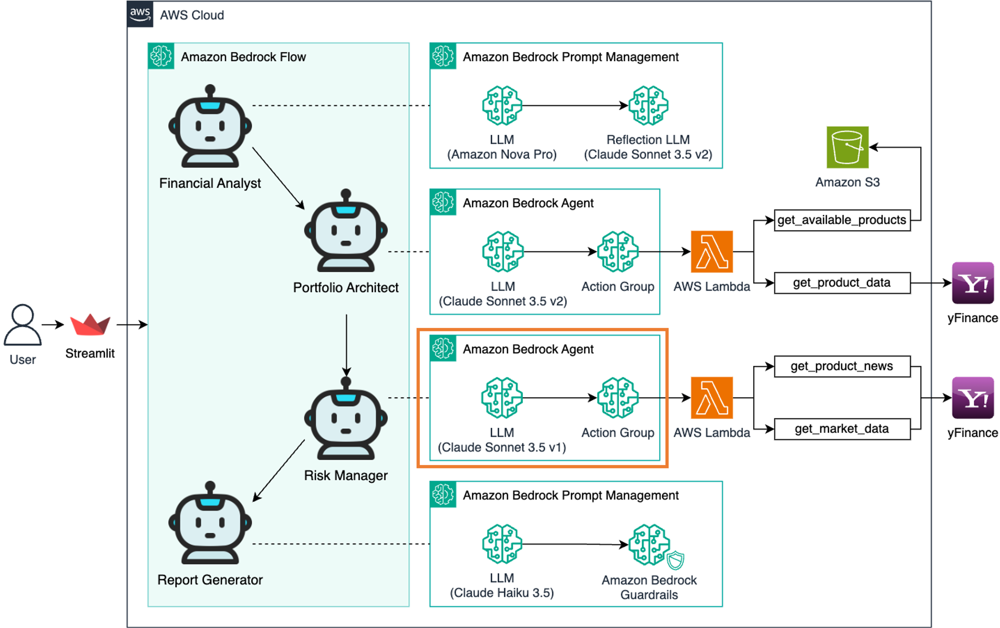

## Architecture

이 모듈에서는 다음을 수행합니다:
- Lambda 함수에 Bedrock Agent의 **Invoke 권한**을 부여
- Bedrock Agent와 Lambda Action Group 연동 테스트
- Bedrock Agent의 **Alias**를 생성하여 버전 관리

---

## 실습

### 1. Bedrock Agent ARN 복사

- AWS 콘솔 → **Bedrock** → **Agents**
- 생성한 `risk_manager` Agent 클릭
- **Agent ARN** 복사 → 메모장에 저장

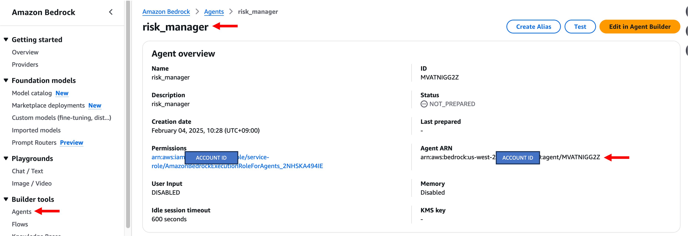

---

### 2. Lambda 권한 설정

- AWS 콘솔 → **Lambda**
- 왼쪽 메뉴 → **Functions** → `lambda-risk-manager` 클릭

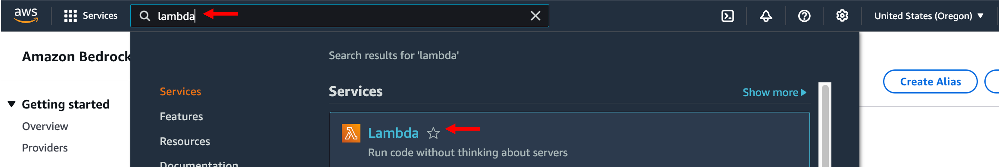  
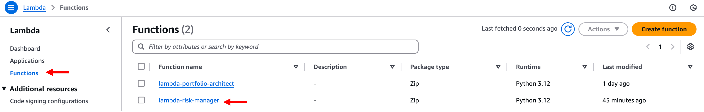

- 상단 탭에서 **Configuration** → 왼쪽 메뉴에서 **Permissions** 클릭

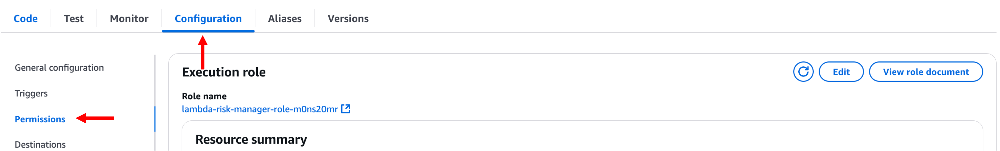

- **Resource-based policy statements** 섹션에서 **Add permissions** 클릭

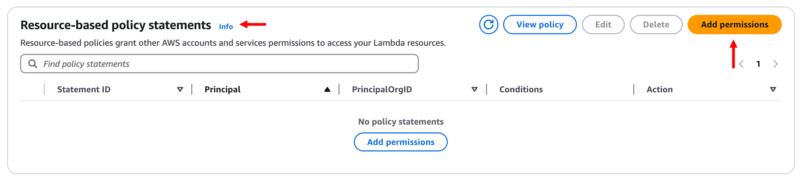

설정 항목:

- **Service**: `Other`
- **Statement ID**: `allow-bedrock-agent`
- **Principal**: `bedrock.amazonaws.com`
- **Source ARN**: 메모장에 저장한 `Agent ARN`
- **Action**: `lambda:InvokeFunction`

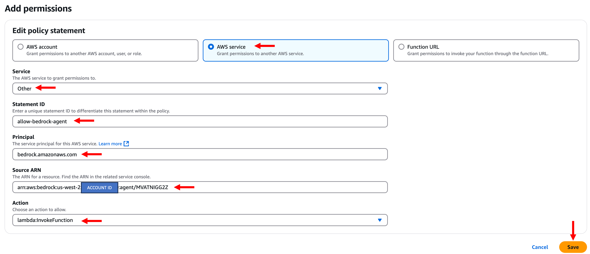

---

### 3. Bedrock Agent 연동 테스트

- AWS 콘솔 → **Bedrock** → **Agents** → `risk_manager` 클릭

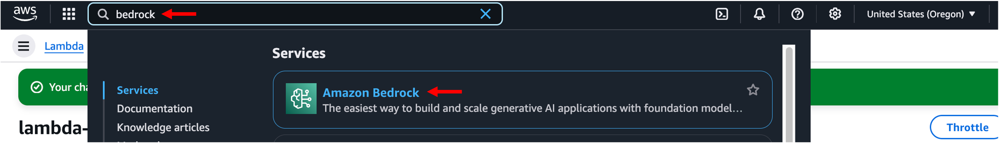  
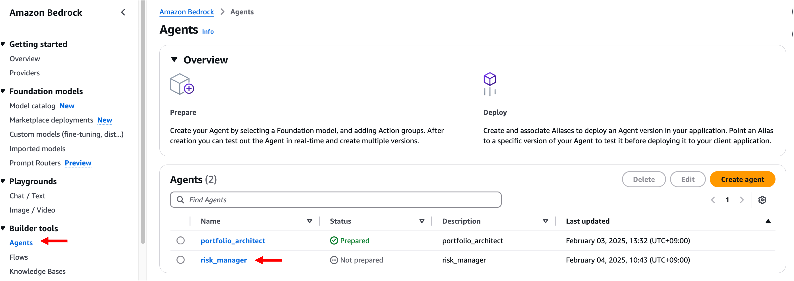

- **Test** 버튼 클릭 → 우측의 **Prepare** 클릭

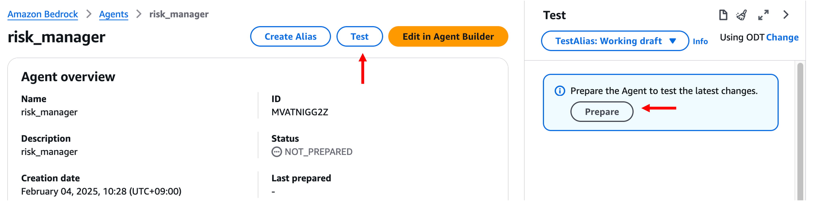

입력 JSON:

```
{
  "portfolio_allocation": {
    "SPY": 60,
    "QQQ": 30,
    "GLD": 10
  },
  "strategy": "고성장 기술주 중심의 공격적 포트폴리오로, 시장 전반의 익스포저와 위험 헤지를 결합한 전략",
  "reason": "고객의 공격적인 위험 성향과 40%의 높은 목표 수익률을 달성하기 위해, 성장성이 높은 기술주(QQQ) 30%를 주축으로 하고, 시장 전반의 성장을 담는 SPY 60%를 배분했습니다. 변동성 위험을 관리하기 위해 GLD 10%를 배분하여 포트폴리오의 안정성을 보완했습니다."
}
```

> ⚠️ 응답 생성에는 수 초가 소요될 수 있습니다. 결과가 출력될 때까지 기다립니다.

**Show trace** 버튼을 눌러 Agent의 내부 추론 경로 확인 가능.

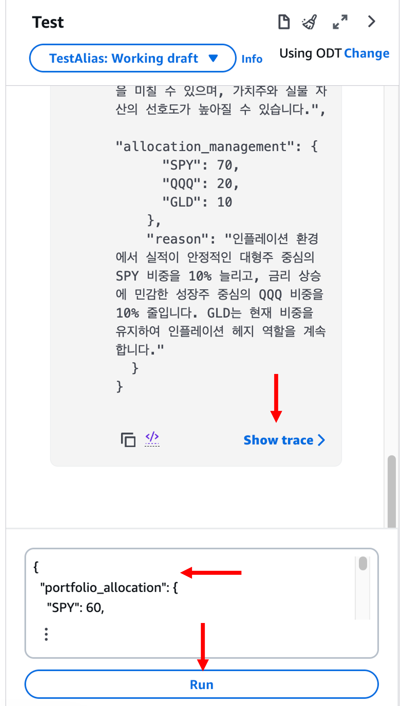

---

### 4. Alias 생성

- Bedrock 콘솔 → `risk_manager` Agent 상세화면
- **Create Alias** 클릭

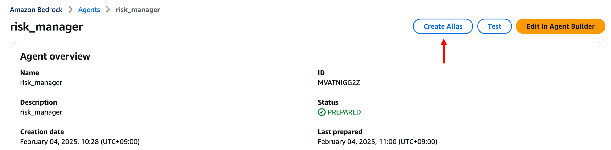

설정 항목:

- **Alias name**: `risk-manager-demo`
- **Description**: `risk-manager-demo` (선택사항)
- **Associate a version**: `Create a new version and associate it to this alias` 선택
- **Throughput**: `On-demand` 선택

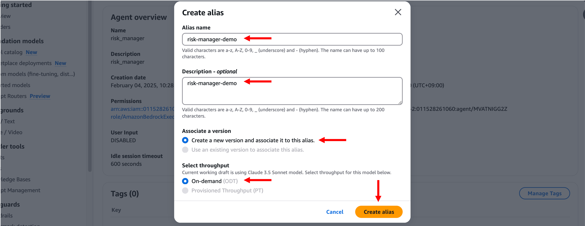

---

### 5. 생성 완료 확인

- 생성된 Alias가 목록에 표시되는지 확인

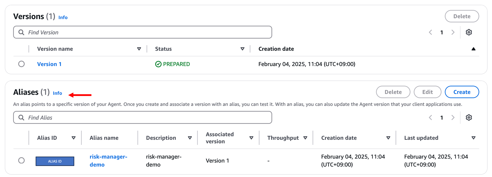

---

## 요약

이제 다음이 완료되었습니다:

- `lambda-risk-manager` 함수에 Agent 호출 권한 부여
- Bedrock Agent 테스트를 통해 Lambda 연동 검증
- `risk_manager` Agent에 Alias 생성

> 다음 모듈에서는 이 Agent를 활용한 **Streamlit 리스크 관리 애플리케이션**을 실행합니다.
