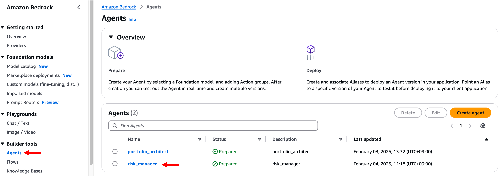
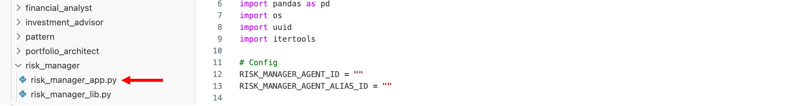

# 모듈 3-4. Streamlit 앱 실행


## Architecture

Streamlit 앱을 실행하여 **리스크 관리사 에이전트**를 테스트합니다.

---

## 실습

### 1. Agent ID 및 Alias ID 복사

- AWS 콘솔 → **Bedrock** → **Agents**
- 생성한 `risk_manager` Agent 클릭



- **Agent ID**, **Alias ID**를 각각 복사하여 메모장 등에 저장


---

### 2. VSCode에서 파일 수정

- VSCode → `~/workshop/ko/risk_manager` 디렉터리로 이동
- `risk_manager_app.py` 파일 열기



- `RISK_MANAGER_AGENT_ID`, `RISK_MANAGER_AGENT_ALIAS_ID` 변수 값을 저장한 ID로 업데이트


---

### 3. Streamlit 앱 실행

VSCode 상단 메뉴 → **Terminal** → **New Terminal** 클릭 후 아래 명령어 실행:

```
cd ~/workshop/ko/risk_manager
```


아래 명령어로 앱 실행:

```
streamlit run risk_manager_app.py --server.port 8080
```


터미널에 출력되는 **External URL** 주소 클릭하여 앱에 접속합니다.

---

### 4. 테스트 입력

앱 실행 후 아래 JSON을 입력 필드에 붙여넣고 **"분석 시작"** 버튼 클릭:

```
{
  "portfolio_allocation": {
    "SPY": 60,
    "QQQ": 30,
    "GLD": 10
  },
  "strategy": "고성장 기술주 중심의 공격적 포트폴리오로, 시장 전반의 익스포저와 위험 헤지를 결합한 전략",
  "reason": "고객의 공격적인 위험 성향과 40%의 높은 목표 수익률을 달성하기 위해, 성장성이 높은 기술주(QQQ) 30%를 주축으로 하고, 시장 전반의 성장을 담는 SPY 60%를 배분했습니다. 변동성 위험을 관리하기 위해 GLD 10%를 배분하여 포트폴리오의 안정성을 보완했습니다."
}
```

> ⏳ **응답 생성에 시간이 소요될 수 있습니다. 잠시 기다려 주세요.**

---

### 5. 결과 확인

- Bedrock Reasoning (추론 내용)
- 리스크 분석 결과

  


---

### 6. 종료

테스트가 끝난 후 터미널로 돌아가서 다음 키를 눌러 애플리케이션을 종료합니다:

```
Control + C
```

---

## 요약

- 리스크 분석 Agent를 Streamlit 앱을 통해 실행
- 입력된 포트폴리오 구성에 대한 리스크 평가 수행
- Bedrock Planning 패턴 기반으로 위험 시나리오 예측 및 대응 전략 수립

> 다음 Lab에서는 지금까지 구현한 모듈을 통합하여 **AI 투자 어드바이저 전체 시스템**을 구축합니다.
