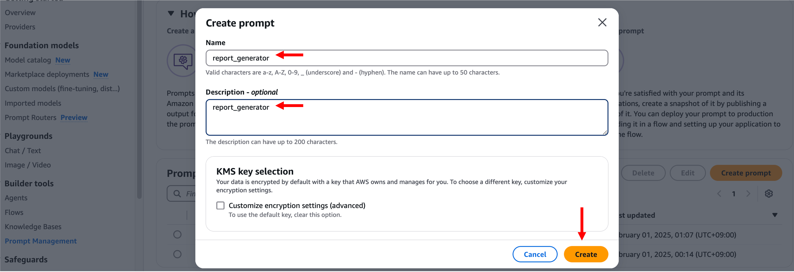

# 모듈 4-1. Prompt 생성

## Architecture

Amazon Bedrock Prompt Management를 이용하여 **리포트 생성가**를 위한 프롬프트를 생성합니다.

---

## 실습

### 1. Bedrock Prompt 생성

- AWS 콘솔 → **Bedrock** → **Prompt Management**
- **Create prompt** 클릭


---

### 2. 프롬프트 정보 입력

- Name: `report_generator` (원하는 이름 가능)
- Description: `report_generator` (생략 가능)


---

### 3. Prompt 내용 입력

Prompt 입력란에 아래 텍스트 입력:

```
당신은 전문적인 투자 어드바이저입니다. 주어진 정보를 바탕으로 투자 포트폴리오 분석 보고서를 작성해야 합니다.

입력 데이터:
사용자 정보:
{{user_input}}
재무 분석 결과:
{{finance_result}}
제안된 포트폴리오 구성:
{{portfolio_result}}
포트폴리오 조정 가이드:
{{risk_result}}

위의 모든 정보를 종합적으로 분석하여 다음 형식을 엄격히 준수하여 분석 보고서를 작성해 주세요.

### 투자 포트폴리오 분석 보고서
#### 1. 고객 프로필 분석
- 이름: 홍길동
- 주소: 서울특별시 강남구 테헤란로 123
- 연락처: 010-1234-5678
- [사용자 정보]
#### 2. 기본 포트폴리오 구성
##### 자산 배분
- [ETF 티커] ([ETF 설명]): [배분 비율]%
##### 배분 전략 근거
- [배분 전략에 대한 설명]
#### 3. 시나리오별 대응 전략
##### 시나리오: [시나리오 1]
조정된 자산 배분:
- [ETF 티커]: [새로운 비율]% ([변화량])
대응 전략:
- [대응 전략]
#### 4. 주의사항 및 권고사항
- [주의사항 및 권고사항]
#### 5. 결론
[포트폴리오 전략에 대한 종합적인 결론 및 권고사항]

작성 시 다음 사항을 고려하세요:
1. 투자의 위험성을 명확히 언급하세요.
2. 고객의 특정 상황에 맞는 맞춤형 조언을 제공하세요.
3. 보고서 끝에 간단한 법적 면책 조항을 포함하세요.
```



---

### 4. 모델 및 설정 적용

- **Select Model** → Amazon → **Haiku 3.5 v1** 선택 → **Apply**


- Inference parameters:
  - Temperature: `0.3`
  - Top P: `0.999`
  - Length: `2000`
  - → **Save draft** 클릭


---

### 5. 테스트

- **Test variables** 영역에 아래 JSON 입력 후 **Run** 클릭:

#### user_input
```
{
  "total_investable_amount": 50000000,
  "age": 35,
  "stock_investment_experience_years": 10,
  "target_amount": 70000000
}
```

#### finance_result
```
{
  "risk_profile": "공격적",
  "risk_profile_reason": "35세의 비교적 젊은 연령대와 10년의 풍부한 주식 투자 경험, 그리고 5천만원 이상의 상당한 투자 가능 금액을 보유하고 있습니다.",
  "required_annual_return_rate": 40.00,
  "return_rate_reason": "목표 금액(7천만원)을 초기 투자금(5천만원)으로 나누면 1.4가 되며, 여기서 1을 빼고 100을 곱하면 40%가 됩니다."
}
```

#### portfolio_result
```
{
  "portfolio_allocation": {
    "SPY": 60,
    "QQQ": 30,
    "GLD": 10
  },
  "strategy": "고성장 기술주 중심의 공격적 포트폴리오로, 시장 전반의 익스포저와 위험 헤지를 결합한 전략",
  "reason": "고객의 공격적인 위험 성향과 40%의 높은 목표 수익률을 달성하기 위해, 성장성이 높은 기술주(QQQ) 30%를 주축으로 하고, 시장 전반의 성장을 담는 SPY 60%를 배분했습니다. 변동성 위험을 관리하기 위해 GLD 10%를 배분하여 포트폴리오의 안정성을 보완했습니다."
}
```

#### risk_result
```
{
  "scenario1": {
    "name": "테크 주도 경기 회복",
    "description": "금리 인하와 함께 기술 섹터가 주도하는 경기 회복이 이루어지는 시나리오입니다.",
    "allocation_management": {
      "SPY": 50,
      "QQQ": 40,
      "GLD": 10
    },
    "reason": "기술 섹터의 성장에 더 많이 노출시키기 위해 QQQ의 비중을 높이고, SPY의 비중을 줄였습니다."
  },
  "scenario2": {
    "name": "인플레이션 지속과 경기 둔화",
    "description": "고금리가 지속되고 인플레이션 압력이 계속되는 가운데 경기 둔화가 나타나는 시나리오입니다.",
    "allocation_management": {
      "SPY": 50,
      "QQQ": 20,
      "GLD": 30
    },
    "reason": "경기 둔화에 대비해 QQQ의 비중을 줄이고, 인플레이션 헤지를 위해 GLD의 비중을 늘렸습니다."
  }
}
```

  


---

### 6. 버전 생성

- **Create Version** 버튼 클릭 → 프롬프트 버전 생성


---

## 요약

- `report_generator` Prompt 생성 완료
- 사용자 정보, 재무 분석, 포트폴리오, 리스크 전략을 종합 분석
- 형식을 고정한 투자 분석 보고서를 생성

> 다음 모듈에서는 이 LLM 출력을 보호하기 위한 **Bedrock Guardrails** 생성을 진행합니다.
