# 모듈 4-2. Bedrock Guardrails 생성

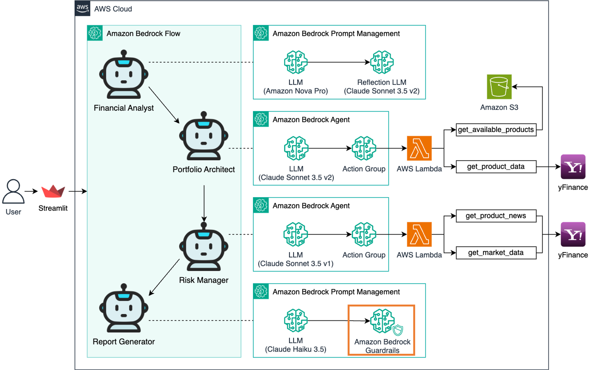

## Architecture

LLM 입력과 출력을 필터링하는 **Amazon Bedrock Guardrails**를 생성합니다.  
이를 통해 **리포트 생성가**의 응답 품질과 안전성을 높이고, 비속어/PII/부적절한 내용에 대한 자동 필터링을 구성합니다.

---

## 실습

### 1. Guardrail 생성 시작

- AWS 콘솔 → **Bedrock**
- 좌측 메뉴 → **Guardrails**
- → **Create guardrail** 클릭

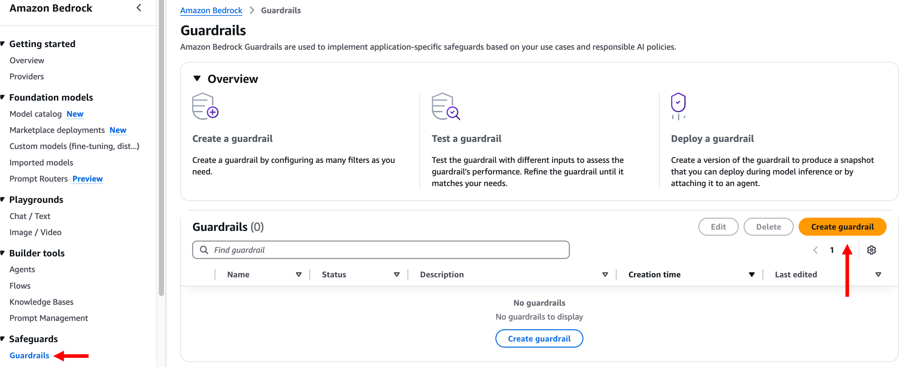

---

### 2. Guardrail 정보 입력

- Name: `report-generator-guardrails`
- Description: `report-generator-guardrails` (생략 가능)
- Messaging for blocked prompts: `Sorry, the model cannot answer this question.` (기본값)

→ **Next** 클릭

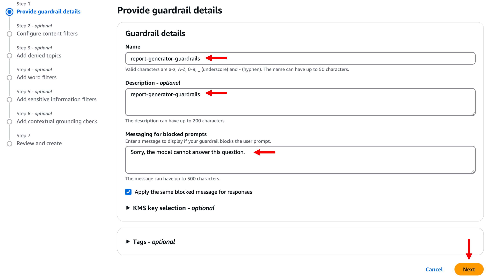

---

### 3. Content Filter 설정

- **Harmful categories**: `Off`
- **Prompt attacks**: `Off`

→ **Next** 클릭

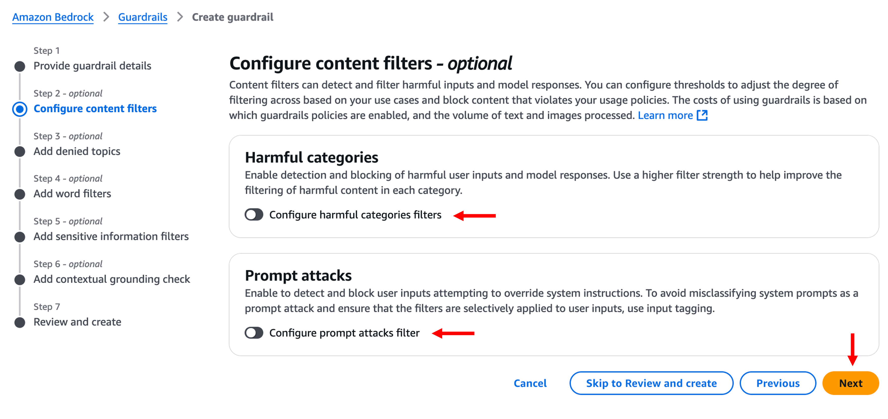

---

### 4. Denied topics

- 설정 없이 **Next** 클릭

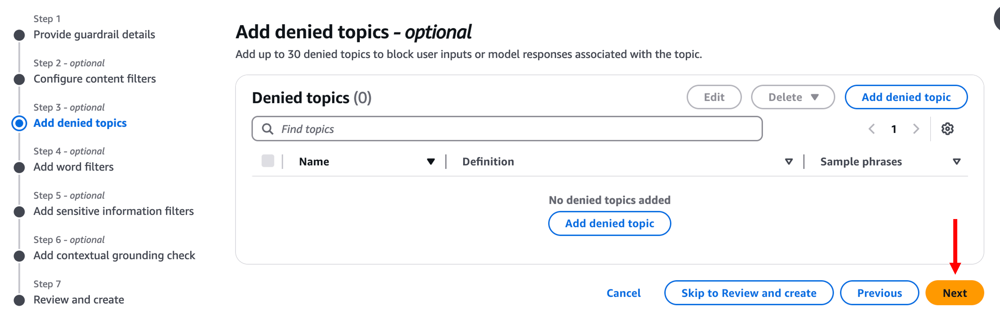

---

### 5. Word filters

- 설정 없이 **Next** 클릭

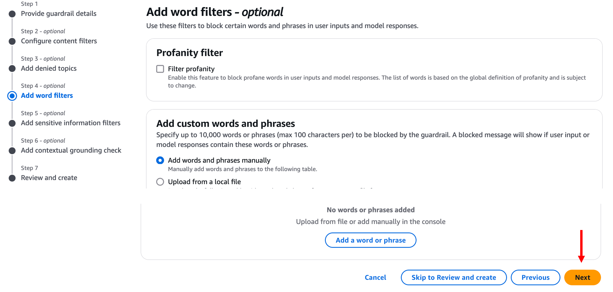

---

### 6. PII (개인 식별 정보) 설정

- **Add all PII types** 메뉴 클릭
- → `Add all PII types (31) with behavior: Mask` 선택

→ 필터링 정책이 자동 추가됨을 확인

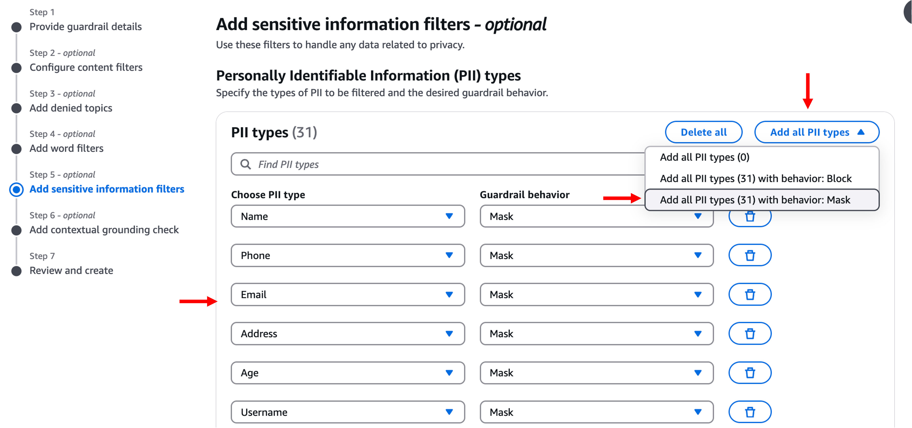

---

### 7. Regex patterns

- 설정 없이 **Next** 클릭

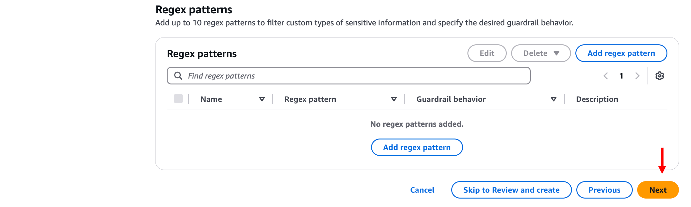

---

### 8. Contextual grounding check

- 설정 없이 **Next** 클릭

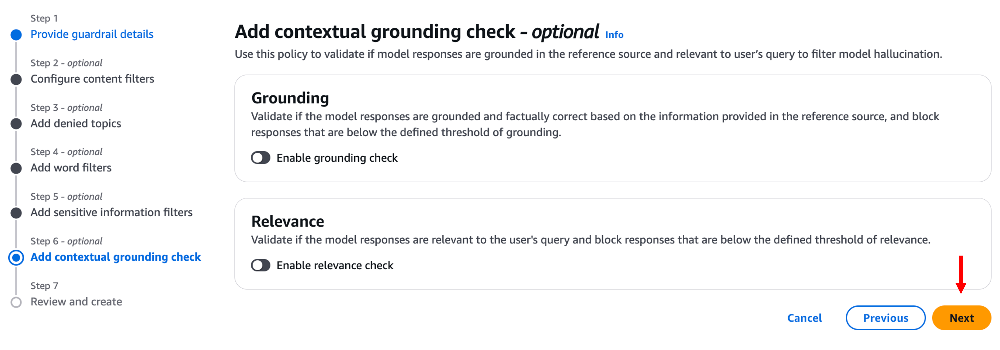

---

### 9. Guardrail 생성 완료

- **Create guardrail** 클릭
- 잠시 후 Guardrail이 생성됨

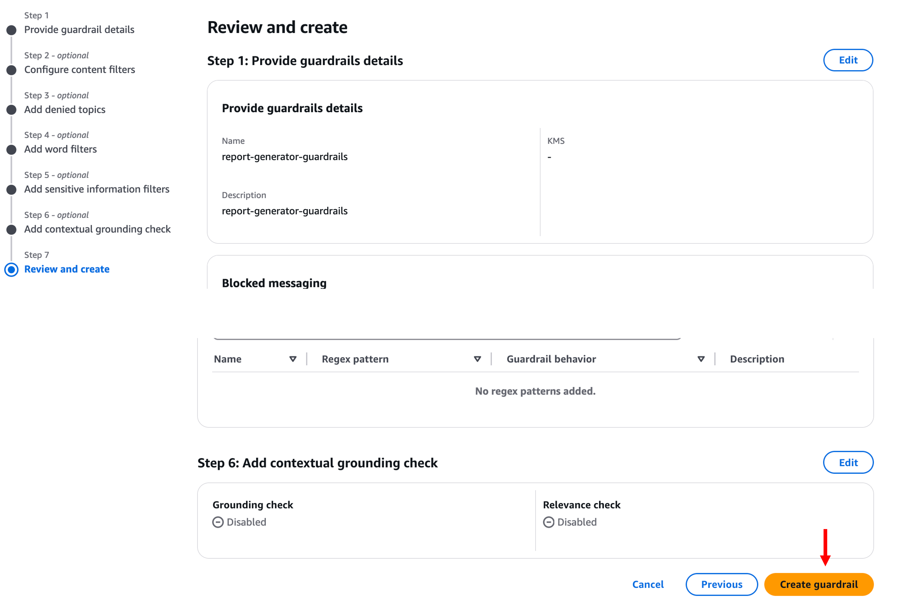

---

### 10. Guardrail Version 생성

- 하단 **Versions** 섹션 → **Create version** 클릭

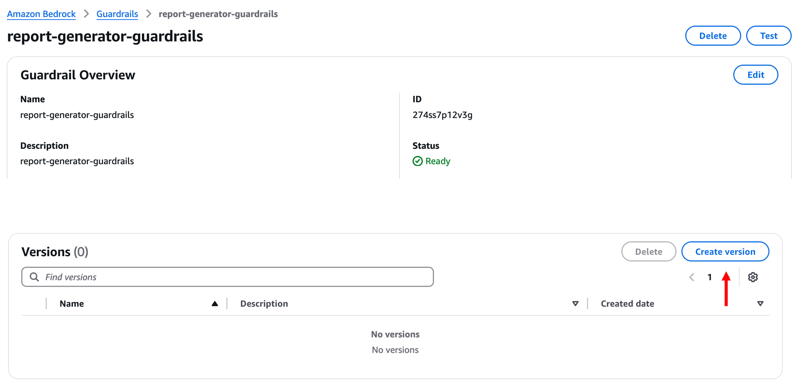

---

### 11. Version 정보 입력

- Description: `guardrails-demo` (생략 가능)

→ **Create version** 클릭

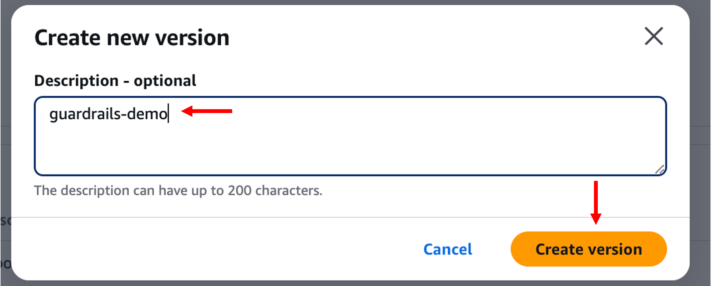  
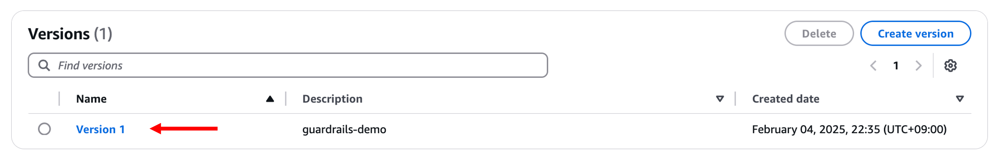

---

## 요약

- `report-generator-guardrails` Guardrail 생성 완료
- PII 마스킹 필터링 설정 포함
- 나머지 민감 콘텐츠 필터는 비활성화 상태
- 안전한 프롬프트 응답 시스템 구성을 위한 기반 완료

> 다음 모듈에서는 **Bedrock Flow**를 통해 종합적인 **AI 투자 어드바이저 시스템**을 시각적으로 구성하는 실습을 진행합니다.
