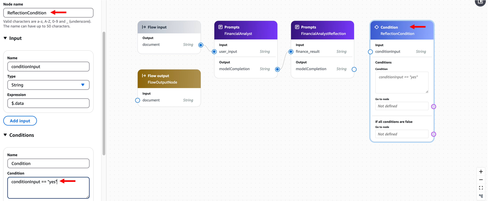

# 모듈 4-3. Bedrock Flow 구성 (Part 1)


## Architecture

Amazon Bedrock Flow를 사용하여 **AI 투자 어드바이저**의 기초를 구축합니다.  
이 단계에서는 **재무 분석가 Agent**와 **Reflection 프로세스**를 Flow에 통합하여 **초기 분석** 단계를 완성합니다.

---

## 실습

### 1. Bedrock Flow 생성

- AWS 콘솔 → **Bedrock**
- 좌측 메뉴 → **Flows** → **Create flow** 클릭


---

### 2. Flow 기본 설정

- Name: `investment_advisor`
- Description: (선택 사항)
- Service role name: `Create and use a new service role`

→ **Create** 클릭


---

### 3. 초기 노드 연결 제거

- Flow input 노드와 Flow output 노드를 잇는 선을 선택
- **BackSpace** 또는 **Delete** 키로 제거


#### 노드 조작 가이드
- **노드 추가**: 좌측 'Nodes' 패널에서 드래그 & 드롭
- **설정 변경**: 노드 클릭 → 우측 Configure 창
- **노드 연결**: 출력점에서 입력점으로 드래그
- **노드 정렬**: 우측 하단 정렬 아이콘 클릭


---

### 4. FinancialAnalyst 노드 추가

- **Prompts** 노드 추가
- **Configure** 패널 설정:
  - Node name: `FinancialAnalyst`
  - Prompt: `financial_analyst`
  - Version: `Version 1`
  - 기타 옵션: Default 유지


#### 연결
- `Flow Input` 노드의 `document` → `FinancialAnalyst` 노드의 `user_input`에 연결


---

### 5. FinancialAnalystReflection 노드 추가

- **Prompts** 노드 추가
- **Configure** 패널 설정:
  - Node name: `FinancialAnalystReflection`
  - Prompt: `financial_analyst_reflection`
  - Version: `Version 1`
  - 기타 옵션: Default 유지


#### 연결
- `FinancialAnalyst` 노드의 `modelCompletion` → `FinancialAnalystReflection` 노드의 `finance_result`


---

### 6. ReflectionCondition 노드 추가

- **Condition** 노드 추가
- **Configure** 패널 설정:
  - Node name: `ReflectionCondition`
  - Condition: `conditionInput == "yes"`



#### 연결
- `FinancialAnalystReflection` 노드의 `modelCompletion` → `ReflectionCondition` 노드의 `conditionInput`
- `ReflectionCondition` 노드의 **False** → `Flow Output` 노드에 연결
- `FinancialAnalystReflection` 노드의 `modelCompletion` → `Flow Output` 노드의 `document`에 연결


---

### 7. Flow 저장 및 테스트

- 우측 상단 **Save** 버튼 클릭


#### Test Flow 실행
우측 상단 **Test flow** → 아래 입력값 넣고 **Run**

```
{
  "total_investable_amount": 50000000,
  "age": 35,
  "stock_investment_experience_years": 10, 
  "target_amount": 400000000
}
```


> 응답 생성에는 수십 초가 걸릴 수 있습니다. 잠시 기다려 주세요.

---

## 요약

- 재무 분석가 + Reflection 패턴을 통한 **분석 유효성 검증** 구조 완성
- Reflection 결과가 “no”인 경우 바로 종료
- 다음 모듈에서는 **포트폴리오 설계사**, **리스크 관리사**, **리포트 생성가** 노드를 Flow에 추가하여 전체 투자 분석 과정을 구성합니다.

