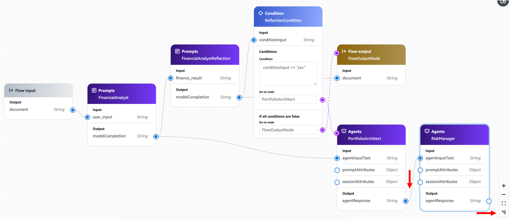

# 모듈 4-4. Bedrock Flow 구성 (Part 2)


## Architecture

이전 모듈에서 구성한 **Bedrock Flow**에 아래 세 가지 주요 구성요소를 추가하여  
AI 투자 어드바이저 시스템을 **완성**합니다:

- 포트폴리오 설계사
- 리스크 관리사
- 리포트 생성가

---

## 실습

### 1. 포트폴리오 설계사 노드 추가

- **Agents** 노드 추가
- **Configure** 설정:
  - Node name: `PortfolioArchitect`
  - Agent: `portfolio_architect`
  - Agent alias: `portfolio-architect-demo`
  - 기타 옵션: 기본값 유지


#### 연결
- `ReflectionCondition` 노드의 **True** → `PortfolioArchitect` 노드로 연결
- `FinancialAnalyst` 노드의 `modelCompletion` → `PortfolioArchitect` 노드의 `agentInputText`


---

### 2. 리스크 관리사 노드 추가

- **Agents** 노드 추가
- **Configure** 설정:
  - Node name: `RiskManager`
  - Agent: `risk_manager`
  - Agent alias: `risk-manager-demo`


#### 연결
- `PortfolioArchitect` 노드의 `agentResponse` → `RiskManager` 노드의 `agentInputText`



---

### 3. 리포트 생성가 노드 추가

- **Prompts** 노드 추가
- **Configure** 설정:
  - Node name: `ReportGenerator`
  - Prompt: `report_generator`
  - Version: `Version 1`
  - Guardrails: `report-generator-guardrails`
  - Guardrails Version: `Version 1`


#### 연결
- `Flow Input` 노드의 `document` → `ReportGenerator` 노드의 `user_input`
- `FinancialAnalyst` 노드의 `modelCompletion` → `ReportGenerator` 노드의 `finance_result`
- `PortfolioArchitect` 노드의 `agentResponse` → `ReportGenerator` 노드의 `portfolio_result`
- `RiskManager` 노드의 `agentResponse` → `ReportGenerator` 노드의 `risk_result`


---

### 4. Flow Output 노드 연결

- `ReportGenerator` 노드의 `modelCompletion` → `Flow Output` 노드의 `document`


---

### 5. Flow 저장 및 테스트

- **Save** 버튼 클릭하여 저장


- 우측 **Test flow** 버튼 클릭 후 아래 값 입력 → **Run**

```
{
  "total_investable_amount": 50000000,
  "age": 35,
  "stock_investment_experience_years": 10, 
  "target_amount": 70000000
}
```


---

### 6. Flow Alias 생성

- **Save and exit** 클릭하여 Flow 상세 페이지 이동
- **Create alias** 클릭


#### Alias 설정
- Alias name: `investment-advisor-demo`
- Description: (선택사항)

→ **Create Alias** 클릭


- 생성된 Alias 확인


---

## 요약

- 전체 AI 투자 분석 흐름을 하나의 Flow로 구성
- 재무 분석 → 유효성 검증 → 포트폴리오 구성 → 리스크 조정 → 종합 리포트 생성
- 다음 모듈에서 **Streamlit 앱**으로 실제 테스트를 수행

