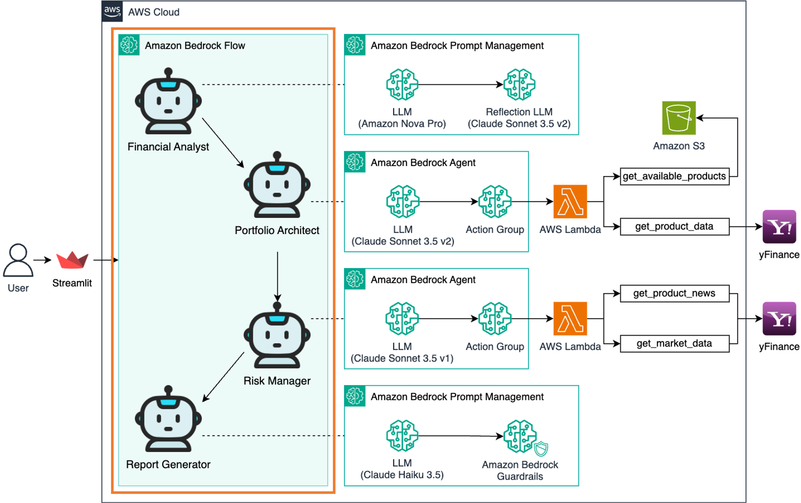
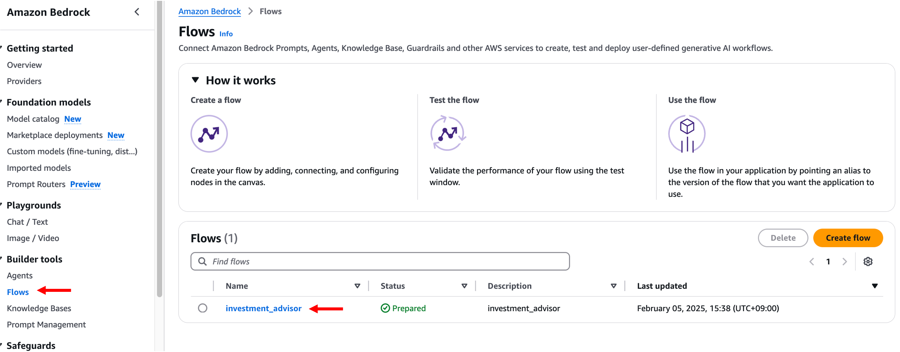
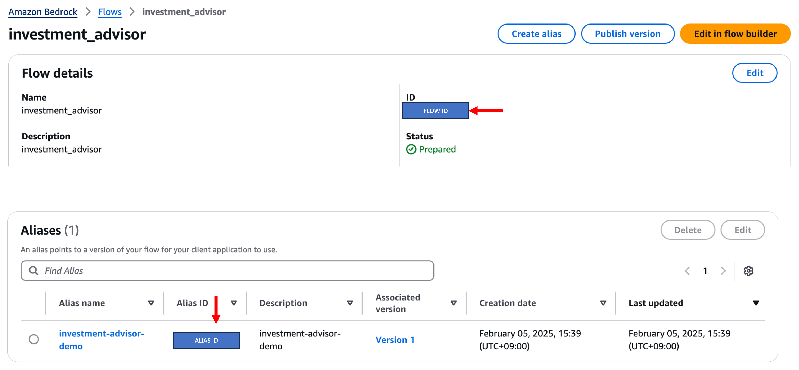
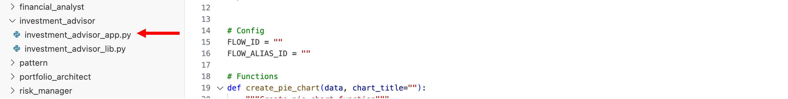
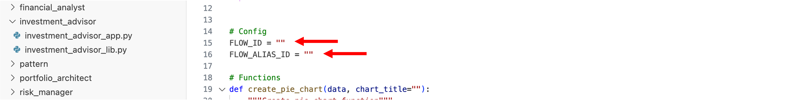
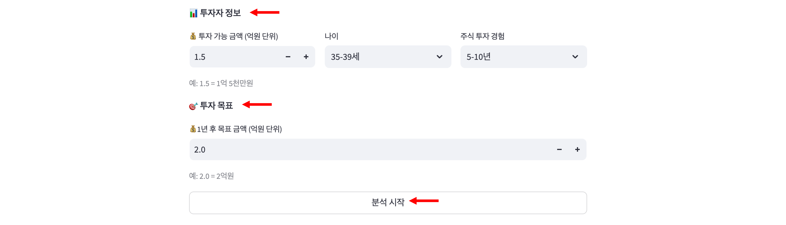
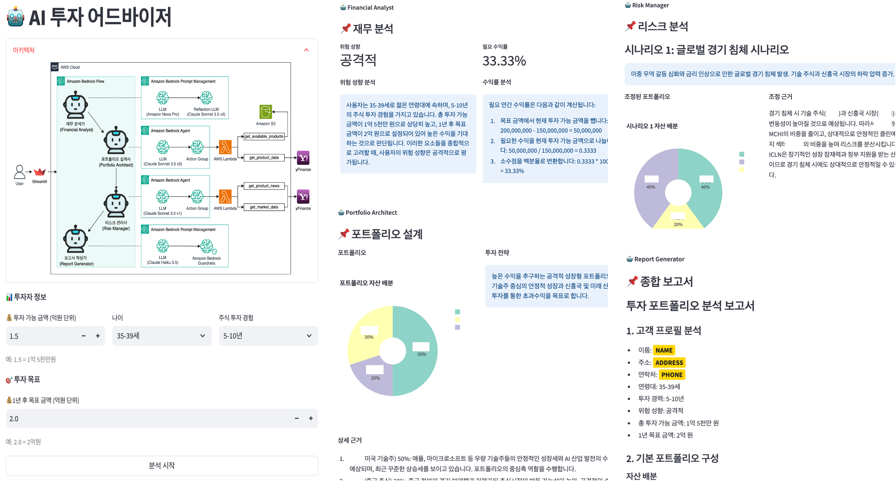

# 모듈 4-5. Streamlit 앱 실행



## Architecture

완성된 **AI 투자 어드바이저 시스템**을 Streamlit 앱에서 실행하고 테스트합니다.  
Bedrock Flow를 기반으로 작동하는 분석 결과를 웹 UI를 통해 확인할 수 있습니다.

---

## 실습

### 1. Bedrock Flow 정보 확인

- AWS 콘솔 → **Bedrock** 서비스 → **Flows** 메뉴 → `investment_advisor` 클릭



- **Flow details**에서 `FLOW ID` 복사  
- **Aliases**에서 `Alias ID` 복사  
→ 메모장 등에 저장



---

### 2. Streamlit 앱 설정

- VSCode에서 아래 디렉터리로 이동

```bash
cd ~/workshop/ko/investment_advisor
```

- `investment_advisor_app.py` 파일 열기



- 파일 내 다음 항목 수정:

```python
FLOW_ID = "<복사한 Flow ID>"
FLOW_ALIAS_ID = "<복사한 Alias ID>"
```



---

### 3. Streamlit 앱 실행

- VSCode 터미널에서 앱 실행

```bash
streamlit run investment_advisor_app.py --server.port 8080
```

- 실행 후 터미널에 출력된 **External URL**을 클릭하여 브라우저에서 접속

---

### 4. 앱 사용 및 테스트

- 사용자 정보를 입력:

  - 투자 가능 금액
  - 나이
  - 주식 투자 경험
  - 목표 금액

- **분석 시작** 버튼 클릭

> ⚠️ 응답 생성에는 수 초 ~ 수십 초가 소요될 수 있습니다.



---

### 5. 분석 보고서 확인

- 다음 항목이 포함된 보고서를 확인:

  - 고객 프로필 분석
  - 기본 포트폴리오 구성
  - 시나리오별 대응 전략
  - 주의사항 및 권고사항
  - 결론



---

### 6. 앱 종료

- 테스트 완료 후 터미널로 돌아가 `Ctrl + C` 입력하여 앱 종료

---

## 요약

- AI 투자 어드바이저는 **Multi-Agent Pattern**을 기반으로 다음 기능을 수행:
  - 재무 분석
  - 포트폴리오 설계
  - 리스크 검증
  - 최종 보고서 생성
- Streamlit UI를 통해 사용자가 직접 투자 분석을 수행 가능

