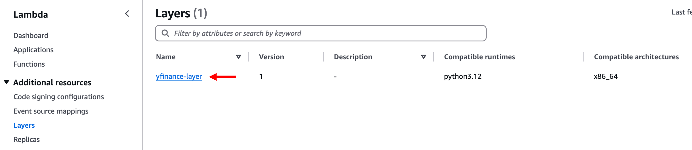

# 리소스 정리

## 목적

실습에 활용한 AWS 리소스를 모두 정리합니다.  
**개인 계정에서 실습했을 경우 요금 발생 방지를 위해 반드시 리소스 정리를 수행해야 합니다.**

---

## 1. CloudFormation

- **CloudFormation** 콘솔 이동
- 생성한 스택 선택 후 **Delete** 클릭

---

## 2. Bedrock

### 2-1. Agents

- **Bedrock → Agents** 메뉴
- 생성한 **Agent** 선택 후 **Delete**

### 2-2. Prompt Management

- **Bedrock → Prompt Management**
- 생성한 **Prompt** 선택 후 **Delete**

### 2-3. Flows

- **Bedrock → Flows**
- 생성한 **Flow** 선택 후 **Delete**

### 2-4. Guardrails

- **Bedrock → Guardrails**
- 생성한 **Guardrail** 선택 후 **Delete**

---

## 3. Lambda

### 3-1. Layers

- **Lambda → Layers**
- 생성한 **Layer** 선택 후 **Delete**

### 3-2. Functions

- **Lambda → Functions**
- 생성한 **Function** 선택
- 상단 **Actions → Delete**

---

## 4. S3

- **S3 → Buckets**
- 생성한 **Bucket** 선택
- **Empty → Delete**

---

## 완료 후 확인사항

- 비용이 발생할 수 있는 리소스가 남아 있지 않은지 AWS 콘솔에서 재확인합니다.
- 필요한 경우 **Billing → Cost Explorer**에서 비용 발생 여부를 점검합니다.

