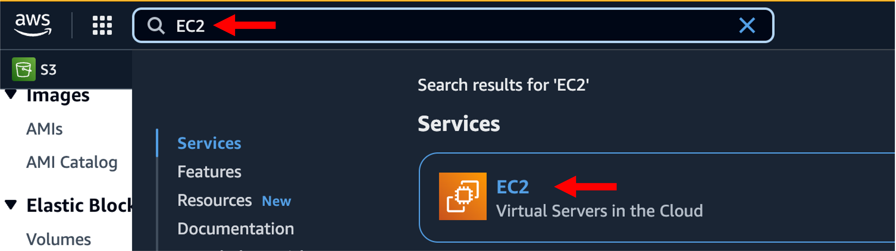
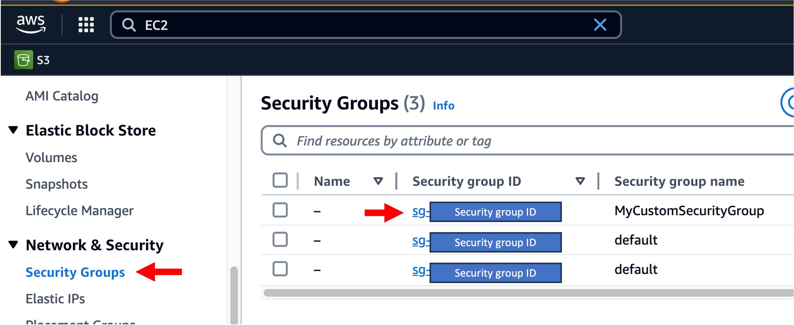
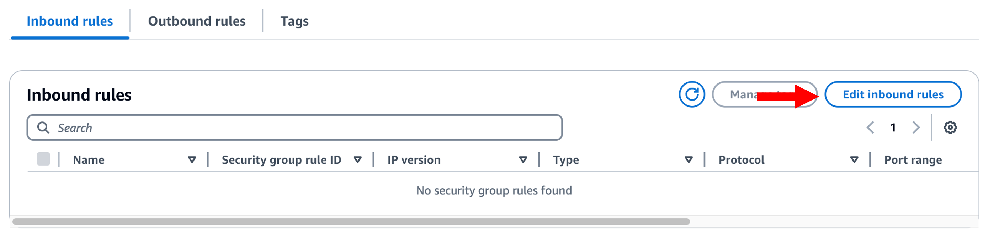
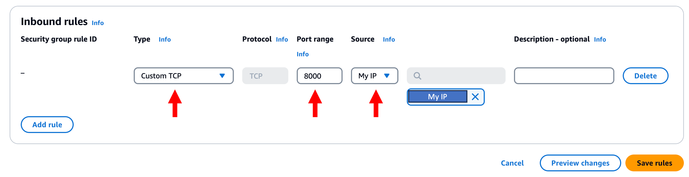
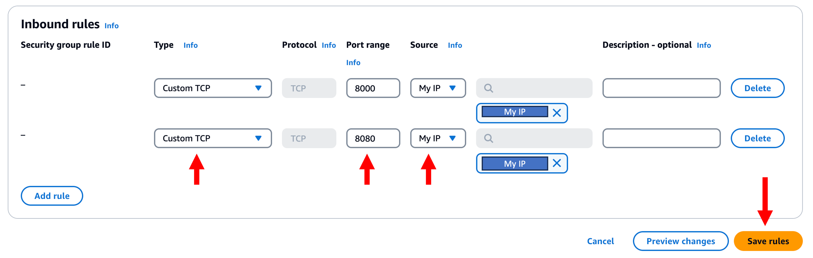
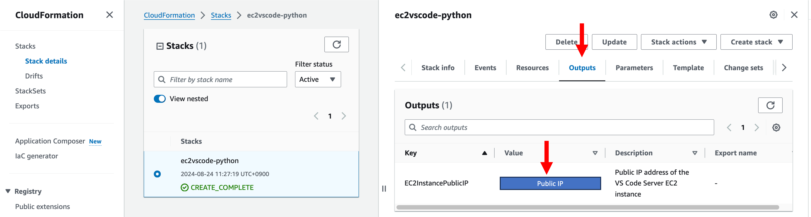
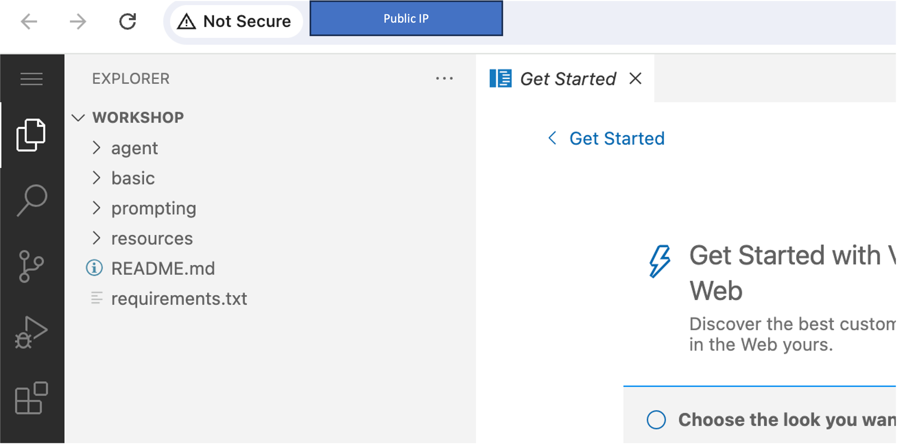

# VSCode on EC2

실습 진행을 위한 Visual Studio Code (VSCode) on EC2 개발환경이 필요합니다.

## 실습 전 주의사항

> **Important**
>
> AWS Workshop Studio를 사용하여 실습을 진행하는 경우, VSCode on EC2 개발 환경 설정 작업이 이미 완료되어 있습니다. 따라서 CloudFormation 스택 생성 과정을 직접 수행할 필요가 없습니다.  
> 단, Security Group 이 모두 Deny 상태이므로, 이를 본인 IP 를 허용하도록 추가하는 과정이 필요합니다.

---

## 보안 그룹 설정 절차

1. **AWS 콘솔**에서 `EC2` 서비스를 검색하고 클릭합니다.

   

2. 좌측 메뉴에서 **Security Groups**를 선택한 후,  
   `Security group name`이 `MyCustomSecurityGroup`인 row에서 **Security group ID**를 클릭합니다.

   

3. **Edit inbound rules** 버튼을 클릭합니다.

   

4. **Add Rule** 버튼 클릭 후 다음과 같이 설정하여 **8000 포트 (VSCode)** 허용 Rule 을 추가합니다:
   - **Type**: Custom TCP
   - **Port range**: `8000`
   - **Source**: My IP

> **Important**  
> VSCode 접속 시 지속적으로 에러가 발생한다면 Source 를 `Anywhere - IPv4`로 변경합니다.  
> 단, 반드시 워크샵 종료 후 다시 `My IP`로 변경해야 합니다. (보안 목적)

   

5. 다시 한 번 **Add Rule** 버튼 클릭 후 다음과 같이 설정하여 **8080 포트 (Streamlit)** 허용 Rule 을 추가합니다:
   - **Type**: Custom TCP
   - **Port range**: `8080`
   - **Source**: My IP

> **Important**  
> VSCode 접속 시 지속적으로 에러가 발생한다면 Source 를 `Anywhere - IPv4`로 변경합니다.  
> 단, 반드시 워크샵 종료 후 다시 `My IP`로 변경해야 합니다. (보안 목적)

   

설정 완료 후 **Save Rules** 버튼을 클릭합니다.

---

## EC2 접속

1. `CloudFormation` 서비스로 이동합니다.
2. Stack 목록에서 해당 Stack 을 클릭 후 `Outputs` 탭에서 `Value` 항목의 **Public IP 주소**를 클릭하거나 복사합니다.
3. 브라우저 주소창에 입력하여 접속합니다.

   

---

## 결과 화면

VSCode 웹 인터페이스에 접속된 화면을 확인합니다.

